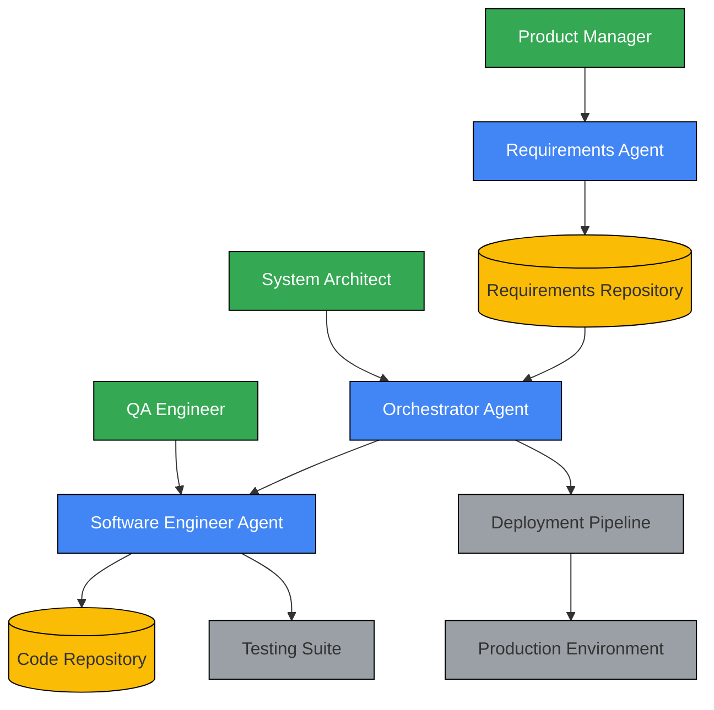
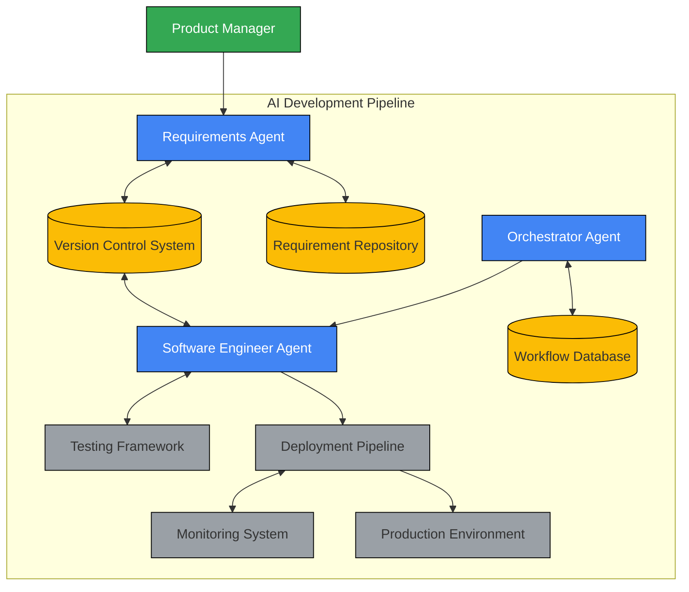

# AI-Driven Development Pipeline: Architecture Overview

## Introduction

This document provides a high-level overview of the AI-driven development pipeline architecture, summarizing the key components, patterns, and decisions that form the foundation of the system. It serves as an entry point to the more detailed architecture documents and provides context for understanding the overall system design.

## Vision and Goals

The AI-driven development pipeline aims to transform software development by enabling autonomous AI coding agents to build, test, and deploy applications with minimal human oversight. The architecture supports a shift from direct oversight to structured delegation, allowing human engineers to focus on product validation and governance rather than code implementation.

### Key Architectural Goals

1. **Enable AI Autonomy**: Create an environment where AI agents can safely and effectively generate code with appropriate constraints and guidance.

2. **Maintain Human Governance**: Establish strategic human validation checkpoints to ensure quality, security, and alignment with business objectives.

3. **Ensure Security and Isolation**: Implement robust security controls to mitigate risks associated with AI-generated code.

4. **Support Scalability**: Design for horizontal scaling to handle increasing workloads and complexity.

5. **Promote Adaptability**: Create a flexible architecture that can evolve as AI capabilities advance.

6. **Deliver Measurable Value**: Provide clear metrics and feedback mechanisms to demonstrate system effectiveness.

## Architectural Overview

The architecture follows a microservices approach with event-driven communication patterns, containerized execution environments, and a strong emphasis on security and human validation checkpoints.

### Core Components

#### AI Agent Ecosystem

The heart of the system consists of three primary AI agent types:

1. **Product Requirements Agent**: Transforms unstructured requirements into structured, AI-readable product specifications.

2. **AI Software Engineer Agent**: Generates code based on structured requirements, following architectural patterns and creating appropriate tests.

3. **Orchestrator Agent**: Coordinates activities across all AI agents, maintains architectural integrity, and manages workflow progression.

#### Execution Environment

The agents operate within a controlled execution environment that provides:

1. **Sandboxed Development Environment**: Isolated Docker containers with limited access to external resources.

2. **Version Control and Artifact Repository**: Stores AI-generated code, documentation, and requirements with full traceability.

3. **AI Development Dashboard**: Monitors agent performance metrics and provides insights into system health.

#### Validation Framework

The architecture incorporates comprehensive validation mechanisms:

1. **Automated Testing Suite**: Validates AI-generated code through unit, integration, and security tests.

2. **Human Validation Checkpoints**: Strategic points where human experts review and approve system outputs.

## Key Architectural Patterns

### Microservices Architecture

The system is built using a microservices architecture to:
- Limit AI context exposure
- Allow agents to generate isolated, self-contained components
- Reduce the risk of cascading failures
- Enable partial updates without system-wide changes

### Event-Driven Communication

Event-driven patterns facilitate asynchronous and decoupled interaction between components:
- Events trigger workflow transitions
- Components communicate via an event bus
- Asynchronous processing improves scalability
- Event sourcing provides complete audit trails

### Defense-in-Depth Security

Multiple layers of security controls protect against various threats:
- Perimeter security with API gateways and network segmentation
- Strong authentication and fine-grained authorization
- Application security with vulnerability management
- Data protection through encryption and access controls
- Continuous monitoring and incident response

### Human-in-the-Loop Validation

Strategic human validation checkpoints ensure quality and governance:
- Requirements validation by product managers
- Execution plan review by system architects
- Code security review by QA and security engineers
- Deployment verification by operations teams

## Technology Stack

The architecture leverages a modern technology stack carefully selected to meet the system's requirements:

### Core AI Technologies
- **Large Language Models**: OpenAI GPT-4, Anthropic Claude, or similar advanced models
- **Agent Frameworks**: LangChain for creating chains of LLM calls with memory

### Backend Services
- **API Framework**: FastAPI (Python) for high-performance, async API development
- **Databases**: PostgreSQL for relational data, MongoDB for documents, Redis for caching
- **Message Queue**: Apache Kafka for event streaming and RabbitMQ for reliable messaging

### Infrastructure
- **Containerization**: Docker for consistent, isolated environments
- **Orchestration**: Kubernetes for container management and scaling
- **CI/CD**: GitHub Actions for automated pipelines

### Security
- **Secret Management**: HashiCorp Vault for centralized secrets
- **Security Scanning**: SonarQube, OWASP tools for vulnerability detection
- **Compliance Monitoring**: Open Policy Agent for policy enforcement

## Data Architecture

The system's data architecture supports the flow of information through the development pipeline:

### Core Data Entities

1. **Requirements Data**: Evolves from unstructured to structured formats for driving development
2. **Code Data**: Represents implementation artifacts through the development lifecycle
3. **Workflow Data**: Tracks state and progress of development activities

### Storage Patterns

The architecture employs different storage solutions for different data types:
- **Relational Database**: User management, workflow tracking, structured metadata
- **Document Database**: Requirements, execution plans, test results
- **Key-Value Store**: Caching, session management, real-time dashboards
- **Event Store**: Workflow events, activity logs, metrics collection

## Deployment Architecture

The deployment architecture supports different environments and scaling requirements:

### Development Environment
- Includes development and testing clusters
- Supports rapid iteration and experimentation
- Provides isolated testing capabilities

### Staging Environment
- Mirrors production configuration
- Enables final validation before deployment
- Allows performance and integration testing

### Production Environment
- Highly available and scalable
- Geographically distributed based on needs
- Comprehensive monitoring and alerting

## Implementation Roadmap

The architecture will be implemented in phases:

### Phase 1: Foundation (Months 1-3)
- Core infrastructure and basic functionality
- Requirements processing and simple code generation
- Basic metrics and monitoring

### Phase 2: Core Functionality (Months 4-6)
- Workflow management and improved AI capabilities
- Comprehensive testing framework
- Human validation interfaces

### Phase 3: Advanced Features (Months 7-9)
- Advanced AI capabilities with multi-agent collaboration
- Detailed analytics and deployment automation
- Extended integrations with third-party tools

### Phase 4: Optimization and Scale (Months 10-12)
- Performance optimization and enhanced security
- Scalability improvements for enterprise usage
- Comprehensive documentation and training

## Architectural Decision Records

Key architectural decisions have been documented in separate ADRs:

1. **[AD-1]**: Adoption of microservices architecture for AI-generated applications
2. **[AD-2]**: Use of Behavior-Driven Development (BDD) for requirements and validation
3. **[AD-3]**: Implementation of isolated execution environments using containers
4. **[AD-4]**: Establishment of mandatory human validation checkpoints

## Reference Architecture

The following diagram illustrates the high-level reference architecture for the AI-driven development pipeline:

## Conclusion

The AI-driven development pipeline architecture establishes a comprehensive framework for enabling autonomous AI coding with appropriate human oversight. By combining advanced AI technologies with robust security controls, human validation checkpoints, and scalable infrastructure, the architecture aims to transform software development while maintaining quality, security, and business alignment.

The success of this architecture depends on the effective implementation of each component and the careful management of interactions between them. As AI capabilities continue to evolve, the architecture provides a foundation that can adapt and grow to incorporate new technologies and approaches. 