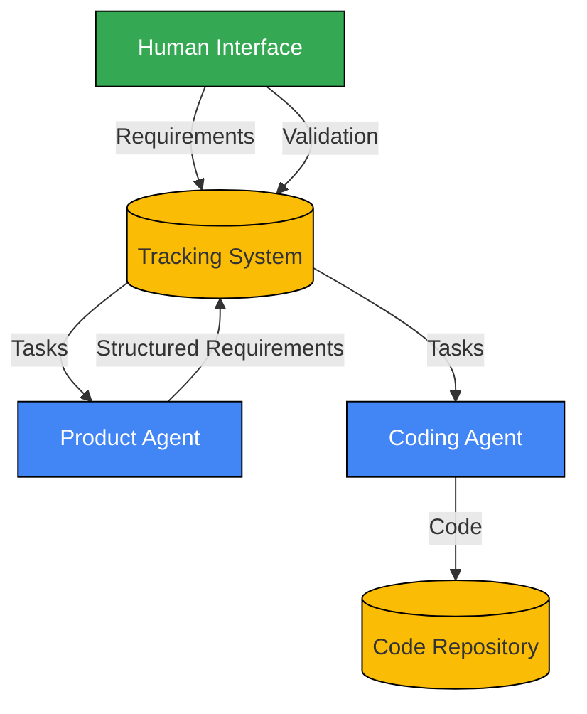

# AI-Driven Development Pipeline: Architecture Overview

## Introduction

This document provides a high-level overview of the AI-driven development pipeline architecture. It serves as an entry point to more detailed architecture documents and provides context for understanding the overall system design.

## Vision and Goals

The AI-driven development pipeline aims to transform software development by enabling autonomous AI coding agents to build software with appropriate human oversight. The architecture supports a shift from direct oversight to structured delegation, allowing engineers to focus on product validation and governance rather than code implementation.

### Key Architectural Goals

1. **Enable AI Autonomy**: Create an environment where AI agents can safely generate code with appropriate constraints.

2. **Maintain Human Governance**: Establish strategic validation checkpoints to ensure quality and business alignment.

3. **Ensure Security**: Implement controls to mitigate risks associated with AI-generated code.

4. **Support Scalability**: Design for horizontal scaling to handle increasing workloads.

5. **Promote Adaptability**: Create a flexible architecture that can evolve as AI capabilities advance.

## Core Components

### Human Interface
Entry point for requirements submission and human validation, implemented via Slack integration, web dashboard, or CLI tools.

### Task Tracking System
Central system for managing work items, statuses, and progress. Tasks flow through multiple validation states, ensuring quality at each step.

### Product Agent
AI agent that transforms unstructured requirements into structured specifications, generating acceptance criteria and implementation plans.

### Coding Agent
AI agent that generates code based on structured requirements, creates tests, and handles implementation tasks.

## Key Architectural Patterns

### Microservices Architecture
- Limits AI context exposure to specific domains
- Reduces risk of cascading failures
- Enables partial updates without system-wide changes

### Event-Driven Communication
- Events trigger workflow transitions
- Asynchronous processing improves scalability
- Event sourcing provides complete audit trails

### Human-in-the-Loop Validation
- Requirements validation by product stakeholders
- Architecture and execution plan review
- Code security review and quality validation

## Architecture Documentation Structure

For more details on specific aspects of the architecture, refer to:

1. **[High-Level Architecture](high_level_architecture.md)**: Core components and their interactions
2. **[Component Architecture](component_architecture.md)**: Detailed component descriptions and lifecycle flows
3. **[Data Flow Architecture](data_flow_architecture.md)**: Information flow patterns and transformations
4. **[Security Architecture](security_architecture.md)**: Security controls and threat mitigations
5. **[Technology Stack](technology_stack.md)**: Recommended technologies for implementation
6. **[Implementation Plan](implementation_plan.md)**: Phased approach to building the system

## Implementation Approach

The architecture will be implemented in phases:

1. **Foundation**: Core infrastructure and basic functionality
2. **Core Functionality**: Task tracking and improved AI capabilities
3. **Advanced Features**: Enhanced generation capabilities
4. **Optimization**: Performance and scalability improvements

See the [Implementation Plan](implementation_plan.md) for detailed timelines and milestones. 