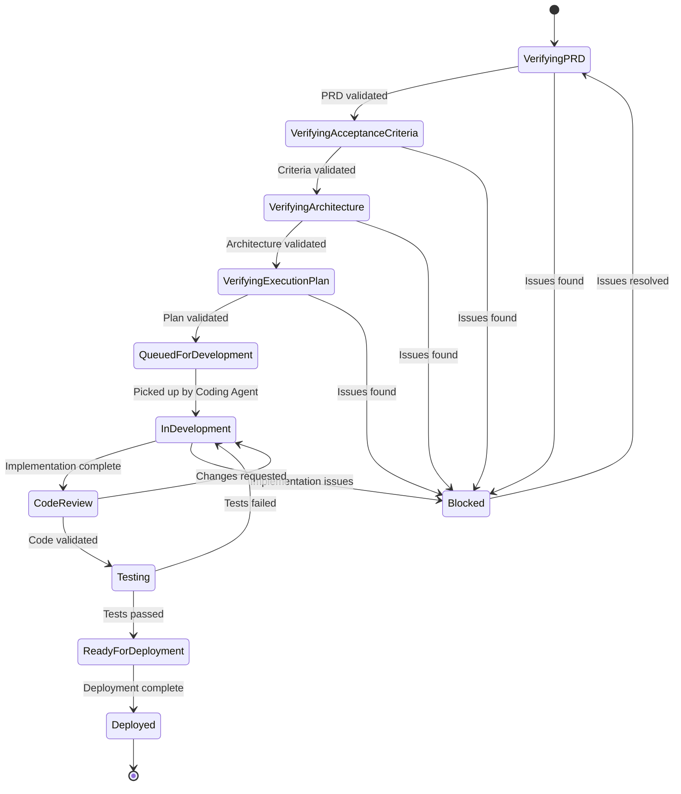
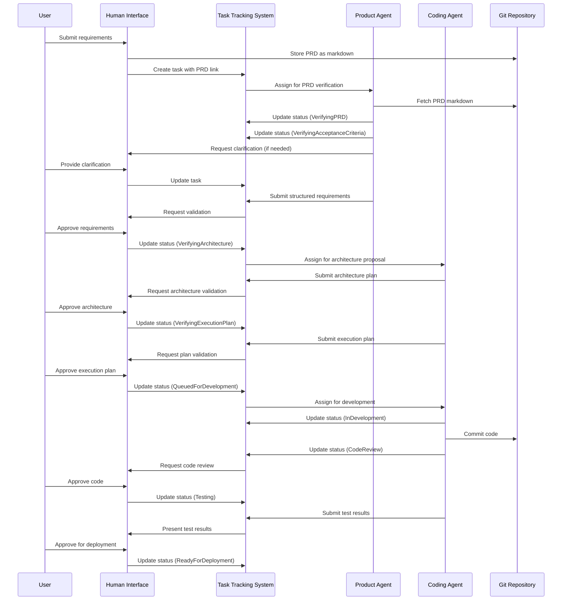

# AI-Driven Development Pipeline: Component Architecture

## Introduction

This document outlines the key components of the AI-driven development pipeline, focusing on their interfaces and interaction patterns. The architecture is designed to be simple and practical, avoiding unnecessary complexity.

## Core Components

### Human Interface

- **Purpose**: Provides interaction points for humans to input requirements and validate outputs
- **Implementation Options**:
  - Slack integration
  - Web-based dashboard
  - CLI tool
- **Key Functions**:
  - Submit requirements (linking to markdown files in git)
  - Review AI outputs
  - Provide approvals at validation checkpoints
  - Track overall project status

### Task Tracking System

- **Purpose**: Central system for managing the status and progress of all work items
- **Implementation**: Similar to Jira or other issue tracking systems
- **Task Statuses**:
  - Verifying PRD - Initial validation of product requirements
  - Verifying Acceptance Criteria - Ensuring clear success metrics
  - Verifying Architecture - Reviewing the proposed technical approach
  - Verifying Execution Plan - Evaluating the implementation strategy
  - Queued for Development - Ready to be picked up by coding agent
  - In Development - Currently being implemented
  - Code Review - Awaiting human validation
  - Testing - Undergoing automated testing
  - Ready for Deployment - Verified and ready to deploy
  - Deployed - Live in production
- **Key Features**:
  - Git integration for PRD linking (PRDs stored as markdown files)
  - Status tracking with timestamps
  - Assignment functionality
  - Commenting and feedback collection
  - Integration with notification systems

### Product Agent

- **Purpose**: Transforms unstructured requirements into structured specifications
- **Interfaces**:
  - Receives tasks from tracking system
  - Updates task status and details
  - Submits generated specifications for review
  - Requests clarifications when needed
- **Responsibilities**:
  - Analyze product requirements documents from git
  - Generate structured specifications
  - Create acceptance criteria
  - Request human feedback when needed

### Coding Agent

- **Purpose**: Generates code based on structured requirements
- **Interfaces**:
  - Receives tasks from tracking system
  - Updates task status and progress
  - Commits code to repository
  - Creates tests and documentation
- **Responsibilities**:
  - Implement features according to specifications
  - Generate appropriate tests
  - Document code and implementation details
  - Submit implementation for review

## System Interactions

### Task Lifecycle Flow

### Component Interaction Flow

## Integration Points

### Git Integration

- **PRD Storage**: 
  - PRDs stored as markdown files in git repository
  - Versioned alongside code
  - Referenced by direct links in tasks

- **Code Storage**:
  - Generated code committed to repositories
  - Includes documentation and tests
  - PR-based review workflow

### Notification System

- Alerts stakeholders of status changes
- Notifies when human validation is required
- Provides updates on task progress

### Testing Framework Integration

- Runs tests on generated code
- Reports results to tracking system
- Maintains test history and metrics

## Security Considerations

- Authentication and authorization for all interactions
- Audit logging of status changes and approvals
- Secure storage of sensitive requirements
- Isolation of AI agent operations

## Implementation Guidelines

- Use webhook-based integrations between systems
- Implement event-driven notification system
- Store task history for traceability
- Provide robust API for extensions 