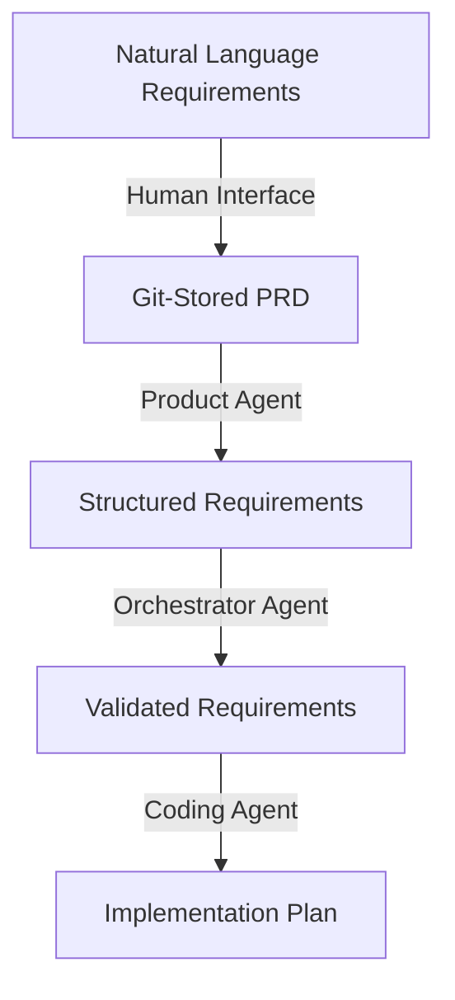
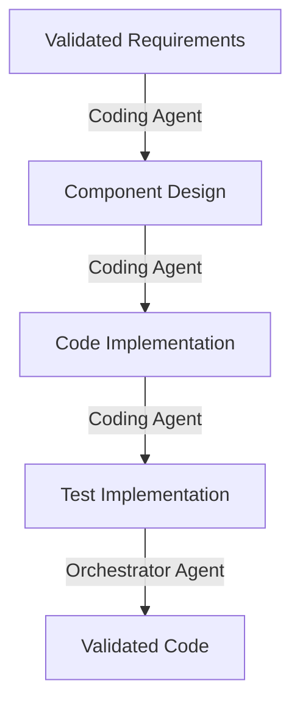
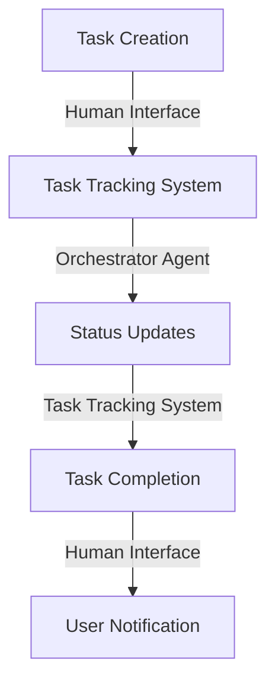
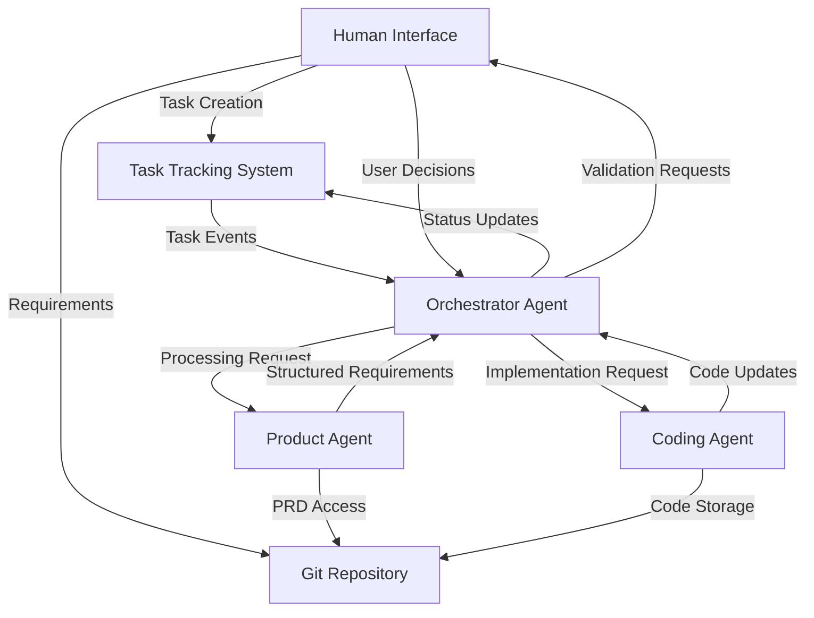

# AI-Driven Development Pipeline: Data Flow Architecture

## Overview

This document describes the flow of data through the AI-driven development pipeline, focusing on the key data entities and their transformations.

The system processes three core data types that flow between components:

1. **Requirements Data** - Product requirements and specifications
2. **Code Data** - Generated code and associated artifacts
3. **Task Status Data** - Workflow state and progression information

## Core Data Entities

### Requirements Data

Requirements data represents the product specifications that drive the development process.

#### Lifecycle:

1. **Creation**: Human users submit requirements through the Human Interface
2. **Storage**: Requirements are stored as markdown files in Git
3. **Processing**: Product Agent analyzes and structures the requirements
4. **Validation**: Human users verify the structured requirements
5. **Tracking**: Task Tracking System monitors status and progress
6. **Consumption**: Coding Agent uses requirements to generate code
7. **Traceability**: Links maintained between requirements and implementation

### Code Data

Code data represents the implementation artifacts generated throughout the development process.

#### Lifecycle:

1. **Planning**: Coding Agent creates architecture and execution plans
2. **Validation**: Human users approve plans via the Human Interface
3. **Generation**: Coding Agent produces code and tests
4. **Review**: Human users validate the generated code
5. **Testing**: Automated tests verify functionality
6. **Storage**: Code is stored in Git repositories
7. **Deployment**: Approved code is deployed to production

### Task Status Data

Task status data represents the state and progress of development activities in the Task Tracking System.

#### Lifecycle:

1. **Creation**: New tasks created for each requirement
2. **Status Updates**: Status changes as work progresses through stages
3. **Assignment**: Tasks assigned to appropriate AI agents
4. **Validation Requests**: Human validation requested at key checkpoints
5. **Completion**: Tasks marked complete when all stages finished

## System-Wide Data Flows

The following diagram shows how data flows between all components:

## Integration Patterns

1. **Event-Driven Updates**
   - Components publish events when state changes
   - Subscribers react to relevant events
   - Reduces tight coupling between components

2. **Git-Based Storage**
   - Both requirements and code stored in Git
   - Provides version history and audit trail
   - Facilitates human review and editing

3. **API-Based Communication**
   - RESTful APIs for synchronous operations
   - WebSocket connections for real-time updates
   - Standard authentication and authorization

4. **Message-Based Coordination**
   - Orchestrator Agent coordinates via messages
   - Ensures reliable delivery of requests
   - Supports retry mechanisms for resilience

## Storage Systems

### Git Repository

- Primary storage for all textual artifacts
- Version control for requirements, code, and tests
- Branching strategy for parallel development
- Pull request workflow for code reviews

### Task Tracking Database

- Central repository for task status and metadata
- Relationships between requirements, tasks, and code
- History of status transitions and validation decisions
- Assignment and ownership tracking

## Security Considerations

- **Authentication**: All system interactions require proper authentication
- **Authorization**: Role-based access controls for different functions
- **Encryption**: Sensitive data encrypted at rest and in transit
- **Audit Logging**: All data transformations and status changes logged
- **Validation**: Data integrity checks at key transformation points

## Implementation Guidelines

- Use webhook integrations between Git and Task Tracking System
- Implement idempotent API operations for reliable processing
- Store minimal data in Task Tracking System, link to Git for details
- Maintain clear audit trail of all AI agent operations
- Design for eventual consistency in distributed operations 