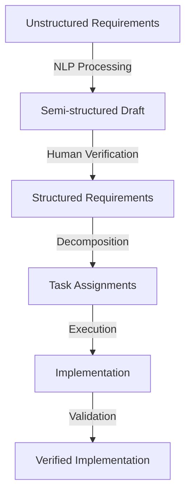
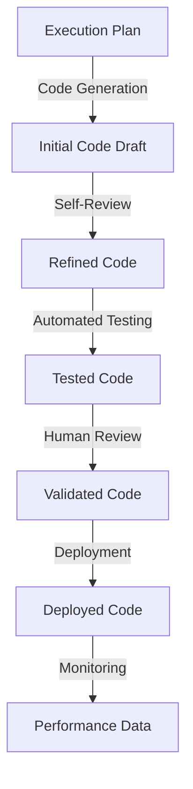
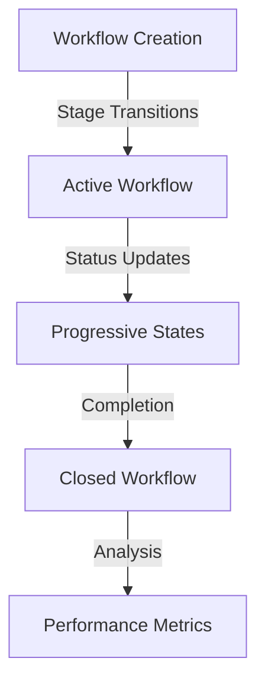
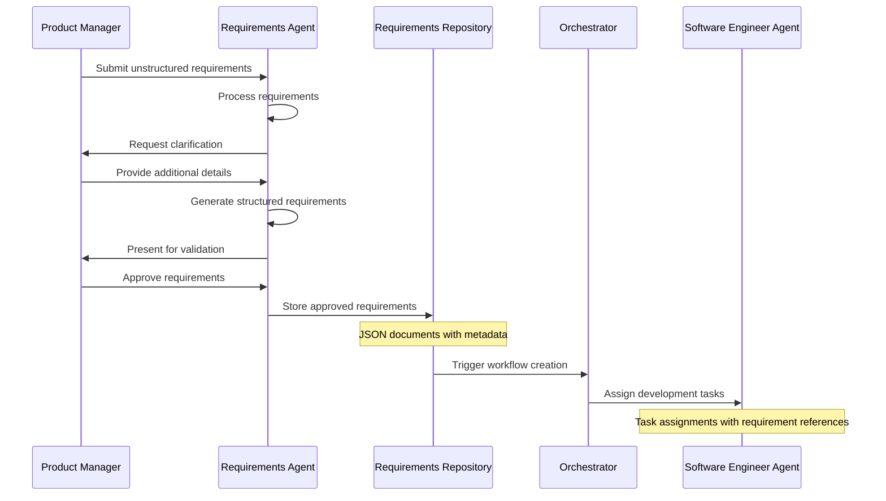
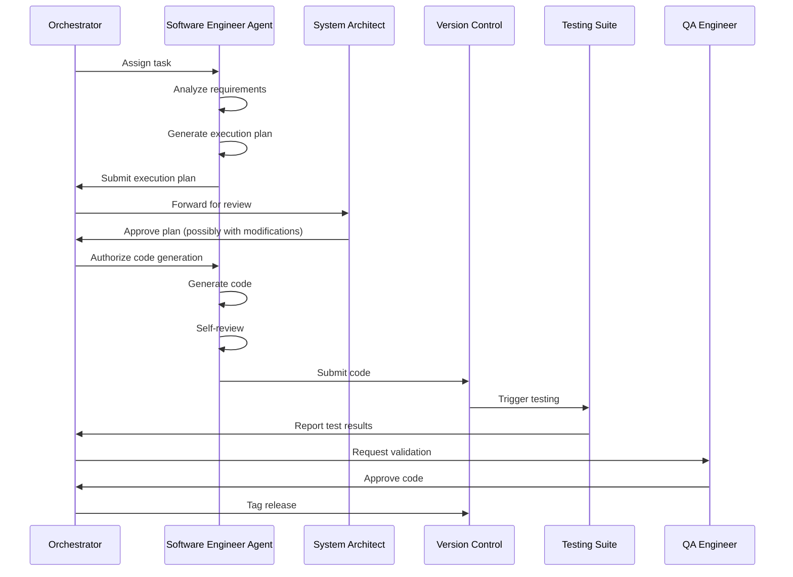
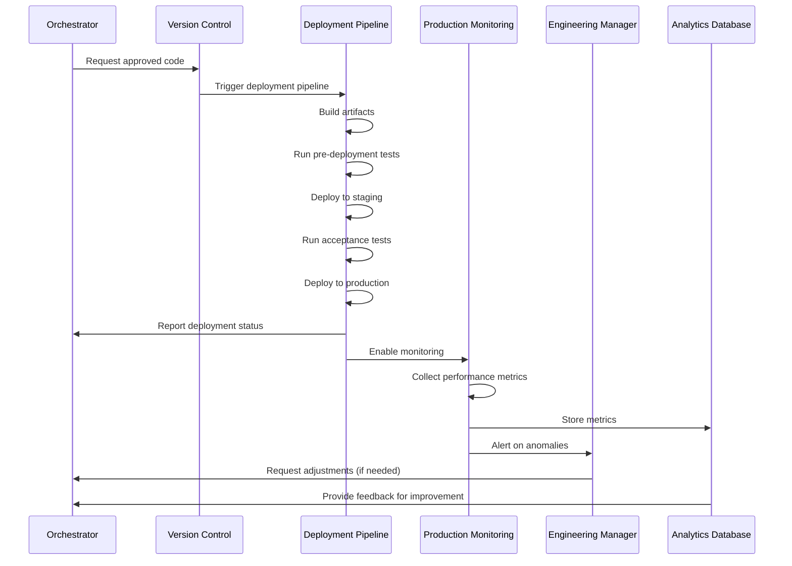
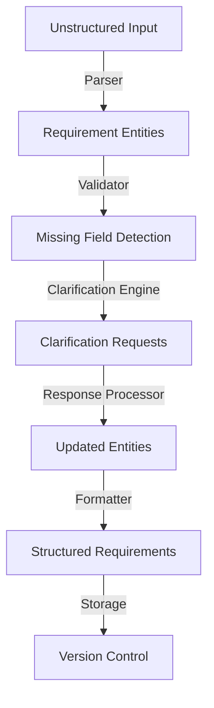
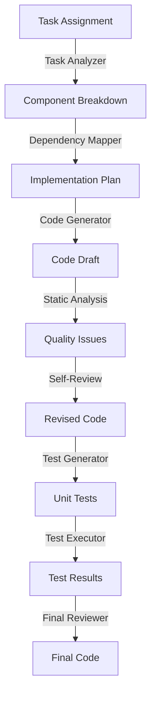
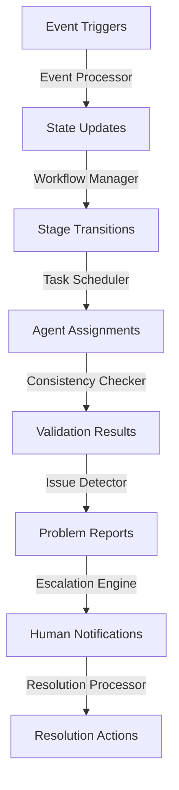

# AI-Driven Development Pipeline: Data Flow Architecture

## Overview

This document describes the flow of data through the AI-driven development pipeline, detailing how information moves between components and is transformed at each step. Understanding these data flows is crucial for ensuring data consistency, implementing effective interfaces, and identifying potential bottlenecks or optimization opportunities.

## Core Data Entities

### Requirements Data

Requirements data represents the product specifications that drive the development process. It evolves from unstructured to structured formats throughout the pipeline.

#### Lifecycle:

1. **Creation**: Product managers submit unstructured requirements
2. **Transformation**: Requirements Agent converts to structured format
3. **Verification**: Human validation ensures accuracy and completeness
4. **Storage**: Stored in version-controlled repositories
5. **Consumption**: Used by AI Software Engineer to generate code
6. **Traceability**: Linked to generated code for auditability

#### Schema Evolution:



### Code Data

Code data represents the implementation artifacts generated throughout the development process.

#### Lifecycle:

1. **Planning**: Task breakdown and execution planning
2. **Generation**: AI Software Engineer generates code
3. **Testing**: Automated tests validate functionality
4. **Review**: Human validation ensures quality and security
5. **Deployment**: Code is deployed to production environments
6. **Monitoring**: Performance and issues are tracked

#### Schema Evolution:



### Workflow Data

Workflow data represents the state and progress of development activities.

#### Lifecycle:

1. **Initiation**: Workflow created when requirements approved
2. **Tracking**: State updates as development progresses
3. **Logging**: Activities and decisions recorded
4. **Analysis**: Metrics calculated for performance tracking
5. **Completion**: Workflow closed when deployment complete

#### Schema Evolution:



## System-Wide Data Flows

### Requirements Processing Flow



Key data exchanges:
- **PM → RA**: Unstructured text, documents, mockups
- **RA → PM**: Clarification requests, structured previews
- **RA → DB**: Structured requirements JSON documents
- **DB → O**: Event notifications with requirement IDs
- **O → SE**: Task assignments with requirement details

### Code Generation Flow



Key data exchanges:
- **O → SE**: Task assignment with requirements and constraints
- **SE → O**: Execution plan with component breakdown
- **O → SA**: Execution plan with architectural implications
- **SE → VCS**: Code files with metadata and commit messages
- **TS → O**: Test results with coverage and failure reports
- **O → QA**: Validation request with test reports and code diff
- **QA → O**: Approval decision with optional comments

### Deployment and Monitoring Flow



Key data exchanges:
- **O → VCS**: Deployment request with version tag
- **VCS → DP**: Source code and deployment configuration
- **DP → O**: Deployment status and results
- **PM → DB**: Performance metrics and logs
- **PM → EM**: Alert notifications with diagnostics
- **EM → O**: Adjustment requests with specific issues
- **DB → O**: Performance analytics for learning

## Component-Specific Data Flows

### Product Requirements Agent



#### Data Transformations:

1. **Text → Entities**: Extraction of actionable items from text
2. **Entities → Validation Results**: Identification of missing information
3. **Validation Results → Clarification Requests**: Generation of specific questions
4. **Responses → Entity Updates**: Integration of additional information
5. **Entities → Structured Documents**: Formatting into standardized schemas

### AI Software Engineer Agent



#### Data Transformations:

1. **Task → Components**: Breakdown of requirements into implementable units
2. **Components → Dependencies**: Mapping relationships between components
3. **Plan → Code**: Generation of source code from plan
4. **Code → Issues**: Identification of quality or security issues
5. **Issues → Revisions**: Application of fixes to code
6. **Code → Tests**: Generation of test cases
7. **Tests → Results**: Execution of tests and collection of results
8. **Results → Final Code**: Integration of test-driven improvements

### Orchestrator Agent



#### Data Transformations:

1. **Events → State Updates**: Conversion of events to workflow state changes
2. **State → Stage Transitions**: Determination of workflow progression
3. **Stage → Tasks**: Generation of appropriate tasks for agents
4. **Components → Validation**: Cross-checking of components for consistency
5. **Validation → Issues**: Identification of problems or conflicts
6. **Issues → Notifications**: Creation of human-readable alerts
7. **Resolutions → Actions**: Implementation of corrective measures

## Data Storage Patterns

### Relational Database (PostgreSQL)

**Primary uses**:
- User and permission management
- Workflow state tracking
- Relationship mapping between entities
- Structured metadata

**Key tables**:
- Users and Roles
- Workflows and States
- Projects and Teams
- Audit Logs

### Document Database (MongoDB)

**Primary uses**:
- Storing structured requirements
- Execution plans and architectural documents
- Test results and reports
- Code analysis results

**Key collections**:
- Requirements
- ExecutionPlans
- TestReports
- AnalysisResults

### Key-Value Store (Redis)

**Primary uses**:
- Caching frequently accessed data
- Session management
- Rate limiting
- Real-time dashboards

**Key structures**:
- Cached Requirements
- User Sessions
- Agent States
- Dashboard Metrics

### Event Store (Kafka)

**Primary uses**:
- Workflow event sourcing
- Activity logs
- Cross-component communication
- Metrics collection

**Key topics**:
- RequirementEvents
- WorkflowEvents
- CodeGenerationEvents
- DeploymentEvents

## Persistent Storage vs. Ephemeral Data

### Persistent Data

**Requirements for persistence**:
- Critical business requirements
- Generated code and artifacts
- Test results and reports
- Deployment configurations
- Performance metrics and logs

**Storage mechanisms**:
- Git repositories for code and requirements
- Databases for structured data
- Object storage for artifacts and large files

### Ephemeral Data

**Types of ephemeral data**:
- Agent working memory
- Intermediate processing results
- Temporary files during code generation
- Debug information

**Storage mechanisms**:
- In-memory data structures
- Temporary files in agent containers
- Short-lived cache entries

## Cross-Cutting Concerns

### Security Considerations

**Data encryption**:
- Encryption at rest for all databases
- TLS for all service communications
- Secure storage of credentials and secrets

**Access control**:
- Role-based access control for all data
- Fine-grained permissions for sensitive operations
- Audit logging for all data modifications

### Data Validation

**Input validation**:
- Schema validation for all API requests
- Content validation for requirements
- Static analysis for generated code

**Output validation**:
- Test coverage for generated code
- Compliance checks for security and quality
- Human validation checkpoints for critical decisions

### Data Retention

**Retention policies**:
- Requirements: Indefinite retention with versioning
- Code: Indefinite retention with versioning
- Logs: Rolling retention based on importance
- Metrics: Aggregation and summarization over time

## Implementation Guidelines

### API Design Principles

1. **RESTful resource modeling**: Design APIs around business entities
2. **GraphQL for complex queries**: Use GraphQL for front-end data requirements
3. **Event-driven for async operations**: Use events for long-running processes
4. **Consistent error handling**: Standardized error responses across all APIs

### Data Serialization Formats

1. **JSON for API communication**: Standard for human-readable data exchange
2. **Protocol Buffers for high-performance needs**: Efficient binary serialization
3. **YAML for configuration**: Human-editable configuration files
4. **Markdown for documentation**: Version-controllable documentation format

### Schema Evolution

1. **Forward compatibility**: Design schemas to handle future fields
2. **Versioning strategy**: Explicit versioning of all APIs and schemas
3. **Migration patterns**: Automated migration of data between schemas
4. **Backward compatibility guarantees**: Ensure old clients work with new systems

## Appendix: Example Data Schemas

### Example Requirement Schema

```json
{
  "$schema": "http://json-schema.org/draft-07/schema#",
  "title": "Structured Requirement",
  "type": "object",
  "required": ["id", "title", "description", "priority", "status"],
  "properties": {
    "id": {
      "type": "string",
      "pattern": "^REQ-[0-9]{3,6}$"
    },
    "title": {
      "type": "string",
      "minLength": 5,
      "maxLength": 100
    },
    "description": {
      "type": "string",
      "minLength": 10
    },
    "submittedBy": {
      "type": "string",
      "format": "email"
    },
    "submittedAt": {
      "type": "string",
      "format": "date-time"
    },
    "approvedBy": {
      "type": "string",
      "format": "email"
    },
    "approvedAt": {
      "type": "string",
      "format": "date-time"
    },
    "priority": {
      "type": "string",
      "enum": ["low", "medium", "high", "critical"]
    },
    "type": {
      "type": "string",
      "enum": ["feature", "bug", "enhancement", "technical"]
    },
    "status": {
      "type": "string",
      "enum": ["draft", "review", "approved", "implemented", "verified"]
    },
    "userStories": {
      "type": "array",
      "items": {
        "type": "object",
        "required": ["id", "asA", "iWant", "soThat"],
        "properties": {
          "id": {
            "type": "string",
            "pattern": "^US-[0-9]{3,6}$"
          },
          "asA": {
            "type": "string"
          },
          "iWant": {
            "type": "string"
          },
          "soThat": {
            "type": "string"
          }
        }
      }
    },
    "acceptanceCriteria": {
      "type": "array",
      "items": {
        "type": "object",
        "required": ["id", "scenario", "given", "when", "then"],
        "properties": {
          "id": {
            "type": "string",
            "pattern": "^AC-[0-9]{3,6}$"
          },
          "scenario": {
            "type": "string"
          },
          "given": {
            "type": "string"
          },
          "when": {
            "type": "string"
          },
          "then": {
            "type": "string"
          }
        }
      }
    },
    "technicalConstraints": {
      "type": "array",
      "items": {
        "type": "string"
      }
    },
    "attachments": {
      "type": "array",
      "items": {
        "type": "object",
        "required": ["name", "contentType", "url"],
        "properties": {
          "name": {
            "type": "string"
          },
          "contentType": {
            "type": "string"
          },
          "url": {
            "type": "string",
            "format": "uri"
          }
        }
      }
    }
  }
}
```

### Example Workflow State Schema

```json
{
  "$schema": "http://json-schema.org/draft-07/schema#",
  "title": "Workflow State",
  "type": "object",
  "required": ["id", "requirementId", "currentStage", "status", "startedAt", "lastUpdatedAt"],
  "properties": {
    "id": {
      "type": "string",
      "pattern": "^WF-[0-9]{3,6}$"
    },
    "requirementId": {
      "type": "string",
      "pattern": "^REQ-[0-9]{3,6}$"
    },
    "currentStage": {
      "type": "string",
      "enum": [
        "requirement_analysis",
        "execution_planning",
        "code_generation",
        "testing",
        "validation",
        "deployment"
      ]
    },
    "status": {
      "type": "string",
      "enum": ["pending", "in_progress", "blocked", "completed", "failed"]
    },
    "startedAt": {
      "type": "string",
      "format": "date-time"
    },
    "lastUpdatedAt": {
      "type": "string",
      "format": "date-time"
    },
    "stages": {
      "type": "array",
      "items": {
        "type": "object",
        "required": ["name", "status"],
        "properties": {
          "name": {
            "type": "string",
            "enum": [
              "requirement_analysis",
              "execution_planning",
              "code_generation",
              "testing",
              "validation",
              "deployment"
            ]
          },
          "status": {
            "type": "string",
            "enum": ["pending", "in_progress", "completed", "failed"]
          },
          "startedAt": {
            "type": "string",
            "format": "date-time"
          },
          "completedAt": {
            "type": "string",
            "format": "date-time"
          }
        }
      }
    },
    "blockers": {
      "type": "array",
      "items": {
        "type": "object",
        "required": ["id", "description", "severity", "createdAt"],
        "properties": {
          "id": {
            "type": "string"
          },
          "description": {
            "type": "string"
          },
          "severity": {
            "type": "string",
            "enum": ["low", "medium", "high", "critical"]
          },
          "createdAt": {
            "type": "string",
            "format": "date-time"
          },
          "resolvedAt": {
            "type": "string",
            "format": "date-time"
          },
          "resolution": {
            "type": "string"
          }
        }
      }
    },
    "metrics": {
      "type": "object",
      "properties": {
        "timeInStage": {
          "type": "string"
        },
        "totalElapsedTime": {
          "type": "string"
        }
      }
    }
  }
}
``` 