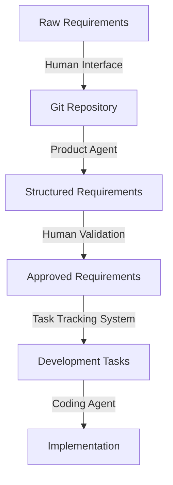
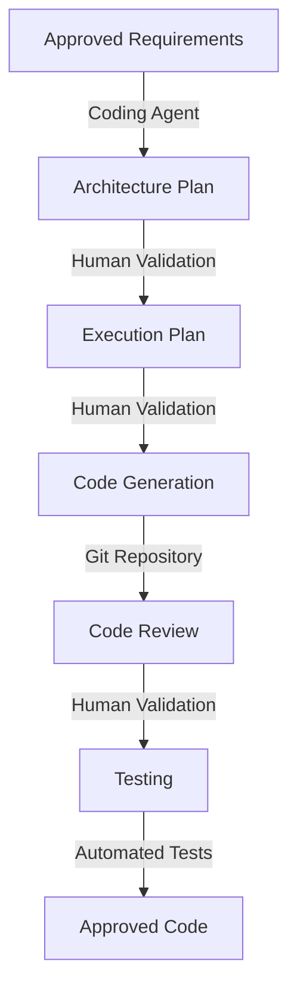
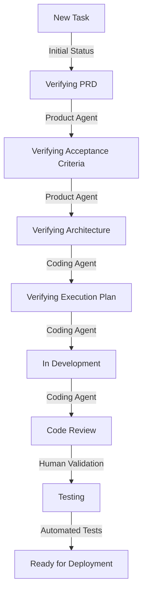
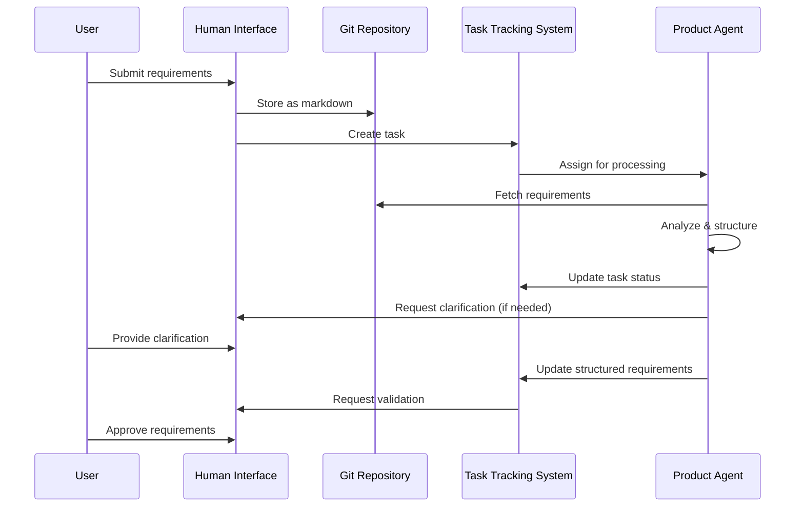
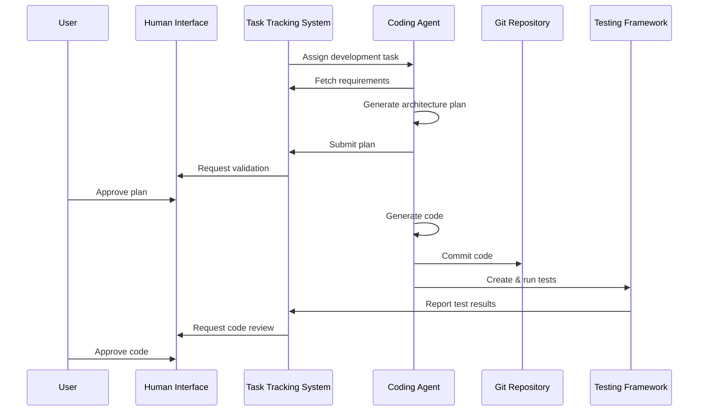

# AI-Driven Development Pipeline: Data Flow Architecture

## Overview

This document describes the flow of data through the AI-driven development pipeline, detailing how information moves between components and is transformed at each step. Understanding these data flows is crucial for ensuring data consistency and implementing effective interfaces.

## Core Data Entities

### Requirements Data

Requirements data represents the product specifications that drive the development process.

#### Lifecycle:

1. **Creation**: Human users submit requirements through the Human Interface
2. **Storage**: Requirements are stored as markdown files in Git
3. **Processing**: Product Agent analyzes and structures the requirements
4. **Validation**: Human users verify the structured requirements
5. **Tracking**: Task Tracking System monitors status and progress
6. **Consumption**: Coding Agent uses requirements to generate code
7. **Traceability**: Links maintained between requirements and implementation

### Code Data

Code data represents the implementation artifacts generated throughout the development process.

#### Lifecycle:

1. **Planning**: Coding Agent creates architecture and execution plans
2. **Validation**: Human users approve plans via the Human Interface
3. **Generation**: Coding Agent produces code and tests
4. **Review**: Human users validate the generated code
5. **Testing**: Automated tests verify functionality
6. **Storage**: Code is stored in Git repositories
7. **Deployment**: Approved code is deployed to production

### Task Status Data

Task status data represents the state and progress of development activities in the Task Tracking System.

#### Lifecycle:

1. **Creation**: New tasks created for each requirement
2. **Status Updates**: Status changes as work progresses through stages
3. **Assignment**: Tasks assigned to appropriate AI agents
4. **Validation Requests**: Human validation requested at key checkpoints
5. **Completion**: Tasks marked complete when all stages finished

## System-Wide Data Flows

### Requirements Processing Flow

### Code Generation Flow

## Integration Patterns

### Git Integration

The system uses Git repositories for storing multiple types of data:

- **Requirements**: Stored as markdown files for version control and traceability
- **Code**: Generated implementation stored with proper commit history
- **Tests**: Test cases and results linked to their corresponding code

### Event-Driven Communication

Status changes in the Task Tracking System trigger events that coordinate activities:

- **Task Created**: Triggers initial processing by Product Agent
- **Status Updated**: Notifies relevant components of new work to be done
- **Validation Required**: Alerts human users of pending review tasks
- **Tests Completed**: Triggers next actions based on pass/fail

### API-Based Integration

Components communicate through well-defined APIs:

- **Human Interface → Task Tracking**: Task creation and updates
- **Task Tracking → Agents**: Task assignments and status updates
- **Agents → Git**: Fetching and committing files
- **Testing Framework → Task Tracking**: Test results reporting

## Storage Systems

### Git Repository

- Primary storage for all textual artifacts
- Version control for requirements, code, and tests
- Branching strategy for parallel development
- Pull request workflow for code reviews

### Task Tracking Database

- Central repository for task status and metadata
- Relationships between requirements, tasks, and code
- History of status transitions and validation decisions
- Assignment and ownership tracking

## Security Considerations

- **Authentication**: All system interactions require proper authentication
- **Authorization**: Role-based access controls for different functions
- **Encryption**: Sensitive data encrypted at rest and in transit
- **Audit Logging**: All data transformations and status changes logged
- **Validation**: Data integrity checks at key transformation points

## Implementation Guidelines

- Use webhook integrations between Git and Task Tracking System
- Implement idempotent API operations for reliable processing
- Store minimal data in Task Tracking System, link to Git for details
- Maintain clear audit trail of all AI agent operations
- Design for eventual consistency in distributed operations 