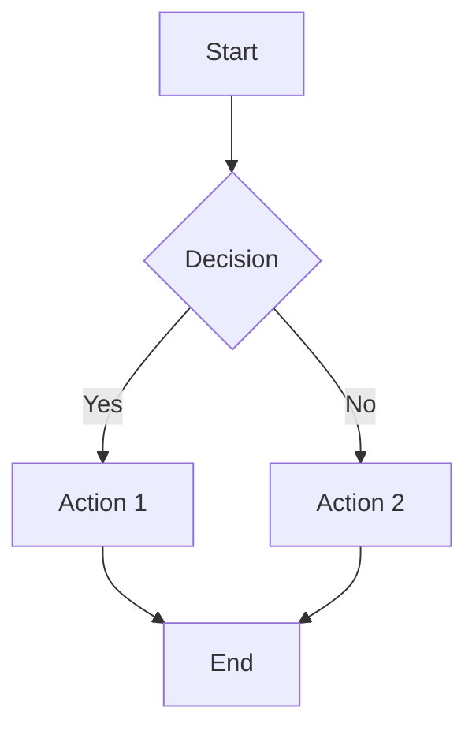
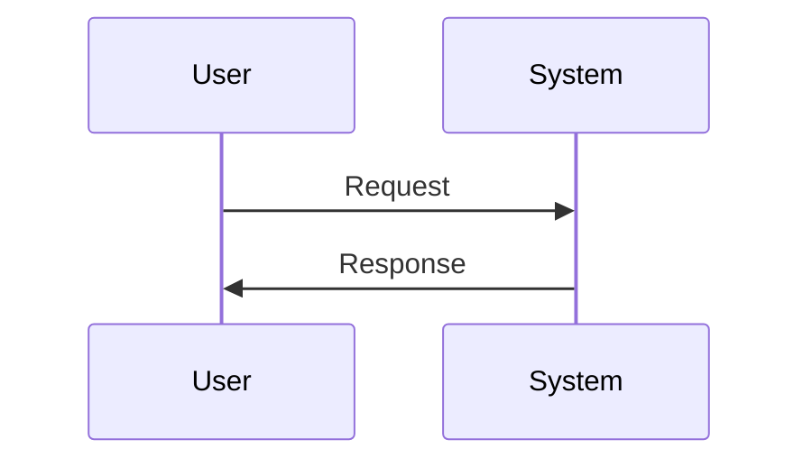
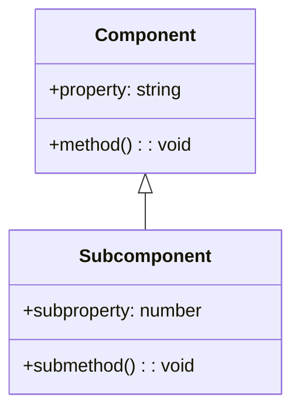
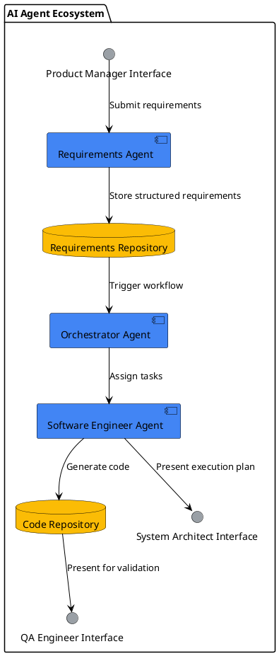

# Architecture Diagrams

This document provides guidance on the management and maintenance of architecture diagrams for the AI-driven development pipeline.

## Diagram Implementation

All architecture diagrams are implemented as embedded [Mermaid](https://mermaid.js.org/) diagrams directly within the markdown documentation. This approach provides several advantages:

1. **Diagram and documentation co-location**: Keeping diagrams with the text provides immediate context
2. **Version control**: Diagrams are versioned along with the documentation
3. **Easy updates**: Edit diagrams directly in the markdown files
4. **Native GitHub rendering**: GitHub automatically renders Mermaid diagrams
5. **No external dependencies**: No need for separate diagram files or external tools

## Mermaid Diagram Examples

Mermaid diagrams use a simple text-based syntax to define diagrams. Here are examples of common diagram types:

### Flowchart Example

### Sequence Diagram Example

### Class Diagram Example

## Diagram Standards

When creating diagrams for the architecture documentation, follow these standards:

1. **Consistency**: Use consistent styling and notation across all diagrams
2. **Readability**: Keep diagrams focused on essential elements and avoid overcrowding
3. **Hierarchy**: Use appropriate levels of abstraction for different documentation types
4. **Color Coding**: Use consistent colors for similar components across diagrams
5. **Labels and Annotations**: Ensure all elements are clearly labeled

## Recommended Styling

For consistency across diagrams, we recommend the following styling:

- **AI Agents**: Blue (#4285F4)
- **Human Roles**: Green (#34A853)
- **Data Stores**: Yellow (#FBBC05)
- **Infrastructure Components**: Gray (#9AA0A6)

## Mermaid Resources

- [Mermaid Official Documentation](https://mermaid.js.org/intro/)
- [Mermaid Live Editor](https://mermaid.live/) - Test and develop diagrams interactively
- [GitHub Mermaid Support Documentation](https://docs.github.com/en/get-started/writing-on-github/working-with-advanced-formatting/creating-diagrams)

## Diagram Types

### System Context Diagrams
- `system_context.png` - High-level overview of the system and its external interactions

### Component Diagrams
- `ai_agent_ecosystem.png` - Detailed view of the AI agent components and their interactions
- `orchestrator_components.png` - Internal structure of the orchestrator agent
- `requirements_agent_components.png` - Internal structure of the requirements processing agent
- `software_engineer_agent_components.png` - Internal structure of the AI software engineer agent

### Data Flow Diagrams
- `requirements_processing_flow.png` - Data flow for requirements processing
- `code_generation_flow.png` - Data flow for code generation
- `deployment_flow.png` - Data flow for deployment and monitoring

### Sequence Diagrams
- `requirements_sequence.png` - Sequence of interactions for requirements processing
- `code_generation_sequence.png` - Sequence of interactions for code generation
- `validation_sequence.png` - Sequence of interactions for human validation
- `deployment_sequence.png` - Sequence of interactions for deployment

### Deployment Diagrams
- `infrastructure_deployment.png` - Physical deployment of infrastructure components
- `application_deployment.png` - Logical deployment of application components

## Diagram Creation and Maintenance

### Recommended Tools

1. **PlantUML**
   - Text-based diagramming tool
   - Version control friendly
   - Integrates with many documentation platforms
   - Website: [PlantUML.com](https://plantuml.com/)

2. **Mermaid**
   - Markdown-based diagramming
   - Supported by many Markdown renderers
   - Good for simple diagrams
   - Website: [Mermaid-js.github.io](https://mermaid-js.github.io/)

3. **draw.io / diagrams.net**
   - Free, browser-based diagramming tool
   - Supports multiple diagram types
   - Can save to version control
   - Website: [diagrams.net](https://www.diagrams.net/)

4. **Lucidchart**
   - Professional diagramming tool
   - Collaborative editing
   - Extensive template library
   - Website: [Lucidchart.com](https://www.lucidchart.com/)

### Diagram Standards

All diagrams should follow these standards:

1. **Consistent Styling**
   - Use consistent colors, shapes, and line styles
   - Follow the defined color scheme for component types
   - Maintain consistent labeling conventions

2. **Clear Labeling**
   - All components should be clearly labeled
   - Use descriptive titles for diagrams
   - Include legends for complex diagrams

3. **Version Control**
   - Store source files (e.g., .puml, .drawio) in version control
   - Generate PNG/SVG files for documentation
   - Update diagrams when architecture changes

4. **Appropriate Detail Level**
   - Match detail level to the diagram's purpose
   - System context diagrams should be high-level
   - Component diagrams can include more detail

### Update Process

1. Update the source diagram file
2. Generate a new PNG/SVG export
3. Update any related documentation
4. Commit both source and generated files to version control
5. Notify the team of significant diagram changes

## Color Scheme

- **AI Agents**: Blue (#4285F4)
- **Human Interfaces**: Green (#34A853)
- **Infrastructure Components**: Gray (#9AA0A6)
- **Data Stores**: Yellow (#FBBC05)
- **External Systems**: Purple (#A142F4)
- **Security Controls**: Red (#EA4335)

## Naming Convention

Diagram files should follow this naming convention:
`<diagram_type>_<subject>_<optional_version>.<extension>`

Examples:
- `component_orchestrator_v1.puml`
- `dataflow_requirements_processing.png`
- `sequence_code_generation.svg`

## Example PlantUML Code

This would generate a component diagram showing the AI Agent Ecosystem with consistent styling and colors.

## Placeholder Diagrams

The initial diagrams may be placeholders or sketches. As the architecture is refined during implementation, these diagrams should be updated to reflect the current state of the system. 