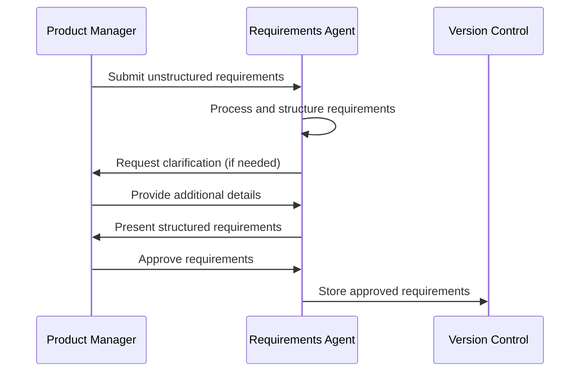
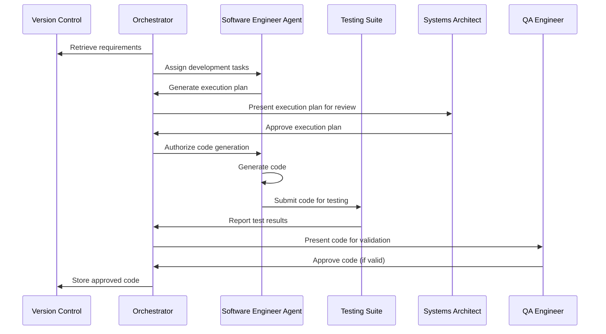
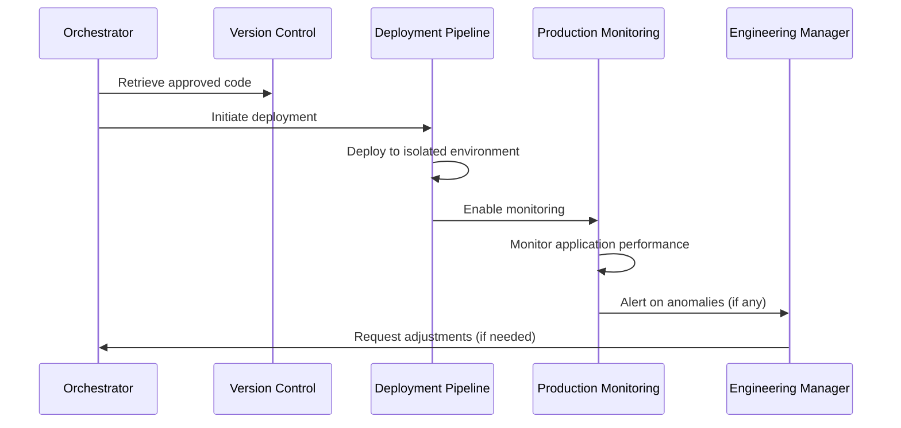

# AI-Driven Development Pipeline: High-Level Architecture

## Overview

This document outlines the high-level architecture for an AI-driven software development pipeline that enables autonomous AI coding agents to build, test, and deploy applications with minimal human oversight. The architecture is designed to support the shift from direct oversight to structured delegation, allowing engineers to focus on product validation and governance rather than code implementation.

## System Components

The architecture consists of the following core components:

### 1. AI Agent Ecosystem

#### 1.1 Product Requirements Agent
- **Purpose**: Transforms unstructured requirements into structured, AI-readable product specifications
- **Responsibilities**:
  - Clarify ambiguities in product requirements
  - Request missing details from product managers
  - Generate structured requirements documents
  - Store requirements in version-controlled repositories
  
#### 1.2 AI Software Engineer Agent
- **Purpose**: Generate code based on structured requirements
- **Responsibilities**:
  - Implement features according to specifications
  - Write tests to validate implementation
  - Follow architectural patterns and guidelines
  - Generate documentation for code
  
#### 1.3 Orchestrator Agent
- **Purpose**: Coordinate activities across all AI agents
- **Responsibilities**:
  - Maintain architectural integrity
  - Ensure integration test compliance
  - Update system documentation
  - Detect and correct inconsistencies between agents
  - Escalate issues requiring human intervention

### 2. Execution Environment

#### 2.1 Sandboxed Development Environment
- Isolated Docker containers for AI agent execution
- Limited access to external resources
- Controlled API access to prevent unintended side effects

#### 2.2 Version Control and Artifact Repository
- Store AI-generated code, documentation, and requirements
- Enable traceability and auditability of all AI activities
- Support rollback capabilities for failed iterations

#### 2.3 AI Development Dashboard
- Monitor AI agent performance metrics
- Track development costs, iteration time, and quality indicators
- Provide insights into system health and potential issues

### 3. Validation Framework

#### 3.1 Automated Testing Suite
- Integration tests to validate AI-generated code
- Security and compliance scanning tools
- Performance testing frameworks

#### 3.2 Human Validation Checkpoints
- Product requirements validation
- Execution plan review
- Code security and compliance checks
- Integration test validation
- Production monitoring and incident escalation

## System Workflows

### 1. Product Requirements Definition

### 2. Code Generation and Validation

### 3. Deployment and Monitoring

## Architectural Decisions

### AD-1: Microservices Architecture
- **Decision**: Adopt a microservices architecture for AI-generated applications
- **Rationale**: 
  - Limits AI context exposure
  - Allows agents to generate isolated, self-contained components
  - Reduces risk of cascading failures
  - Enables partial updates without system-wide changes

### AD-2: Behavior-Driven Development (BDD) Approach
- **Decision**: Use BDD for defining requirements and validation criteria
- **Rationale**:
  - Provides clear, structured scenarios for AI to follow
  - Enables automated validation of business requirements
  - Creates a common language between business and technical stakeholders
  - Serves as a guardrail for AI-driven development

### AD-3: Isolated Execution Environments
- **Decision**: Run AI agents in sandboxed Docker containers
- **Rationale**:
  - Prevents unintended system modifications
  - Limits the impact of AI hallucinations or errors
  - Provides consistent, reproducible environments
  - Enables safe parallel execution of multiple agents

### AD-4: Human Validation Checkpoints
- **Decision**: Implement mandatory human validation at key decision points
- **Rationale**:
  - Ensures alignment with business objectives
  - Prevents propagation of errors or misunderstandings
  - Maintains human governance over critical decisions
  - Builds trust in the AI-driven process

## Security Considerations

### Access Control
- AI agents operate with least-privilege access
- Different permission levels for different agent types
- Strict API access controls to prevent unauthorized actions

### Code Security
- Automated security scanning for all AI-generated code
- Regular vulnerability assessments
- Integration with existing security practices and tools

### Data Protection
- Encryption of sensitive requirements and specifications
- Access logging for all system interactions
- Compliance with relevant data protection regulations

## Scalability Considerations

### Agent Pooling
- Dynamic scaling of AI agent instances based on workload
- Load balancing across agent pools
- Resource allocation optimization

### Resource Management
- Efficient use of computational resources
- Cost monitoring and optimization
- Performance benchmarking and improvement

## Implementation Roadmap

The architecture will be implemented in phases:

### Phase 1: Foundation
- Set up isolated development environments
- Implement version control integration
- Develop initial AI agent prototypes
- Create basic monitoring dashboard

### Phase 2: Core Functionality
- Develop requirements processing capabilities
- Implement code generation for non-critical components
- Create automated testing framework
- Establish validation checkpoints

### Phase 3: Advanced Features
- Enhance orchestration capabilities
- Implement full microservices support
- Develop comprehensive monitoring and analytics
- Enable production deployment pipeline

### Phase 4: Optimization
- Improve AI agent efficiency and reliability
- Enhance security measures
- Optimize resource utilization
- Scale the system for larger applications

## Conclusions

This architecture provides a foundation for an AI-driven development pipeline that balances autonomy with appropriate human oversight. By implementing a structured system with clear validation checkpoints, the architecture aims to leverage the capabilities of AI agents while maintaining the quality, security, and business alignment of the resulting software.

The success of this approach will be measured using the metrics defined in the AI Development Dashboard, including total cost, iteration time, change failure rate, and lead time. These metrics will guide ongoing optimization and evolution of the architecture. 