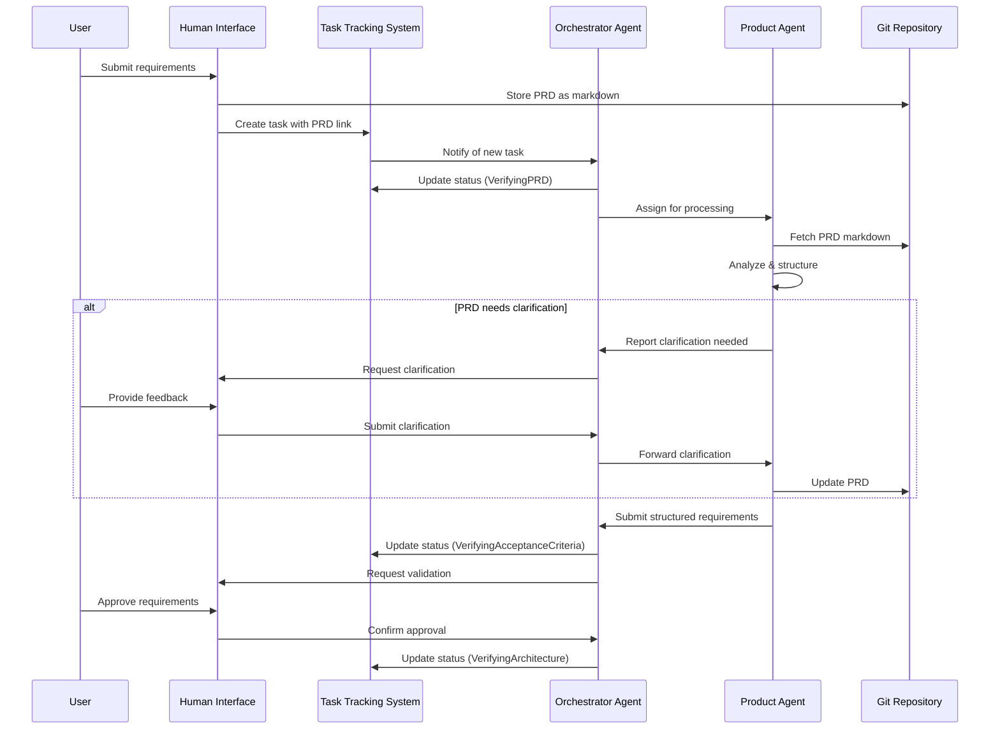
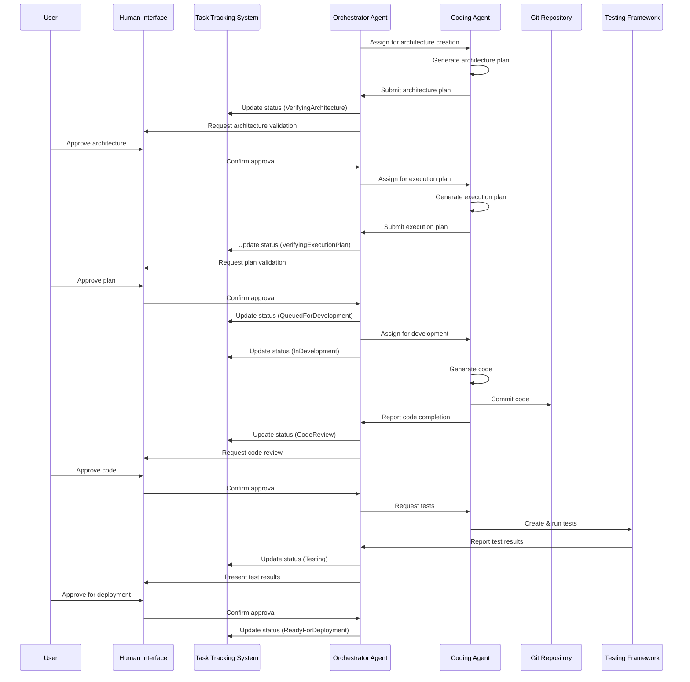

# AI-Driven Development Pipeline: High-Level Architecture

## Overview

This document details the high-level architecture for an AI-driven software development pipeline that enables autonomous AI coding agents to build applications with human validation at key checkpoints. Building on the [Architecture Overview](architecture_overview.md), this document focuses on system workflows, architectural decisions, and cross-cutting concerns.

## Core Components

The architecture consists of five primary components, which are detailed in the [Component Architecture](component_architecture.md) document:

1. **Human Interface**: Entry point for requirements and validation
2. **Task Tracking System**: Manages workflow status and progression
3. **Orchestrator Agent**: Coordinates workflow and assigns tasks to specialized agents
4. **Product Agent**: Processes requirements and generates specifications
5. **Coding Agent**: Generates code based on specifications

## System Workflows

### 1. Requirements Processing Workflow

### 2. Code Generation Workflow

## Architectural Decisions

### AD-1: Microservices Architecture
- **Decision**: Adopt a microservices architecture for AI-generated applications
- **Rationale**: 
  - Limits each AI agent's context to specific domains
  - Enables focused development with clear interfaces
  - Reduces risk of cascading failures
  - Allows for progressive enhancements

### AD-2: Git-Based PRD Management
- **Decision**: Store product requirements as markdown files in Git
- **Rationale**:
  - Provides version control for requirements
  - Enables transparent change tracking
  - Facilitates human readability and editing
  - Integrates with existing development workflows

### AD-3: Orchestrator-Driven Workflow
- **Decision**: Use a dedicated Orchestrator Agent to manage workflow progression
- **Rationale**:
  - Centralizes workflow coordination logic
  - Allows specialized agents to focus on their specific tasks
  - Provides a single point of control for workflow state
  - Ensures consistency in task transitions and status updates

### AD-4: Human Validation Checkpoints
- **Decision**: Implement mandatory human validation at key decision points
- **Rationale**:
  - Ensures alignment with business objectives
  - Prevents propagation of errors or misunderstandings
  - Maintains human governance over critical decisions
  - Builds trust in the AI-driven process

## Security Considerations

### Access Control
- Role-based permissions for different user types
- Least privilege access for AI agents
- API access controls with strong authentication

### Code Security
- Automated security scanning for AI-generated code
- Pre-commit validation for security standards
- Regular vulnerability assessments

### Data Protection
- Encryption for sensitive requirements
- Access logging for all system interactions
- Validation of data integrity across transformations

## Scalability Considerations

### Agent Scaling
- Stateless AI agent design allows horizontal scaling
- Independent scaling of Orchestrator, Product, and Coding agents
- Containerized deployment enables dynamic resource allocation

### Task Distribution
- Asynchronous task processing reduces coupling
- Task prioritization for efficient resource utilization
- Parallel processing of independent tasks

## Next Steps

Once the architecture is understood, refer to the following documents for more detailed information:

1. [Component Architecture](component_architecture.md) - Detailed component specifications
2. [Data Flow Architecture](data_flow_architecture.md) - Data transformations
3. [Security Architecture](security_architecture.md) - Comprehensive security controls
4. [Technology Stack](technology_stack.md) - Implementation technologies
5. [Implementation Plan](implementation_plan.md) - Phased approach to building the system 