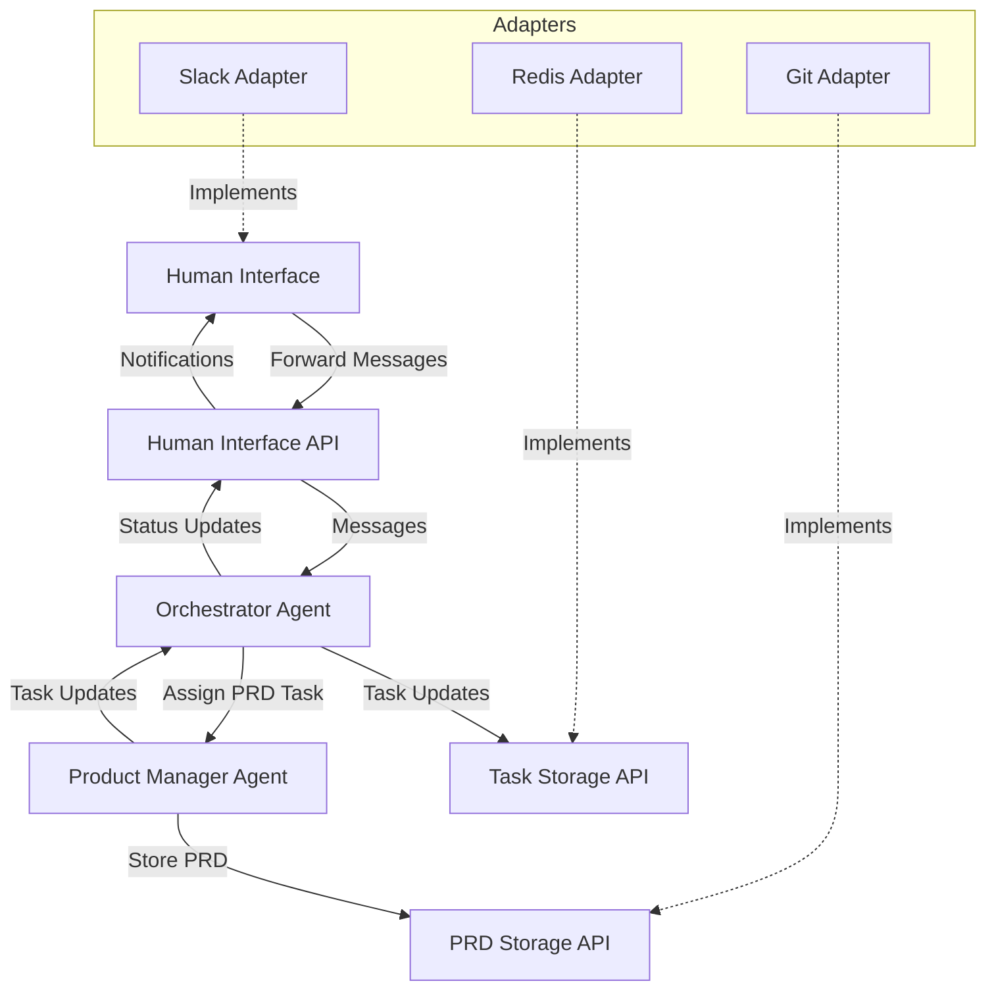
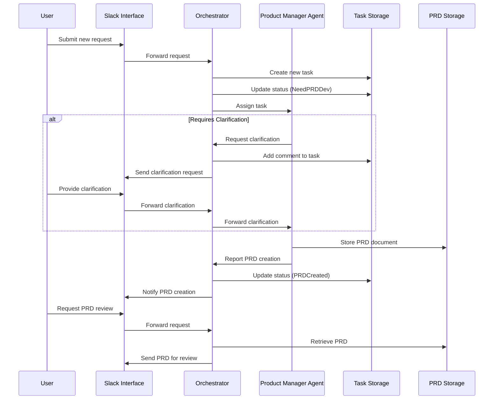

# Phase 1 Implementation: Product Refinement Workflow

## Overview

Phase 1 focuses on implementing the foundation of the AI-driven development pipeline, with particular emphasis on the product refinement workflow. This phase will establish the basic backbone of the system using LangChain, implementing the Human Interface, Task Tracking System, Orchestrator Agent, and Product Manager Agent.

## Goals

- Implement a functional product refinement workflow
- Create system backbone with interface abstractions
- Enable PRD creation and refinement
- Establish communication between Human Interface and AI agents

## Architecture Components

### System Architecture



### Component Details

1. **Human Interface API**
   - Abstract interface for user interactions
   - Support for receiving messages, providing notifications
   - Extension points for different UI implementations

2. **Slack Adapter**
   - Implementation of Human Interface API for Slack
   - Translates Slack-specific formats to internal formats
   - Handles Slack authentication and channel management

3. **Task Storage API**
   - Abstract interface for task tracking
   - Support for CRUD operations on tasks
   - Query functionality for task status and history

4. **Redis Adapter**
   - Implementation of Task Storage API using Redis
   - Task data serialization/deserialization
   - Simple key-value storage patterns

5. **PRD Storage API**
   - Abstract interface for PRD document storage
   - Support for versioning, updating, and retrieving PRDs
   - Abstraction for different storage backends

6. **Git Adapter**
   - Implementation of PRD Storage API using Git
   - Handles markdown file operations
   - Manages commits and versioning

7. **Orchestrator Agent**
   - Central coordinator for workflow
   - Routes messages to appropriate agents
   - Manages task state transitions
   - Communicates status updates to Human Interface

8. **Product Manager Agent**
   - Specialized agent for PRD creation and refinement
   - NLP processing to understand requirements
   - Creates structured PRD documents
   - Identifies clarification needs

## Implementation Details

### Workflow Implementation



### LangChain Implementation

1. **Agent Implementation**
   - Use LangChain's agent framework for Orchestrator and Product Manager
   - Implement custom tools for task management and PRD creation
   - Use Chain of Thought for clarification decision making

2. **Message Handling**
   - Implement message routing with LangChain's message history
   - Maintain conversation context across interactions
   - Structure prompts for specific agent roles

3. **Task State Management**
   - Define task states (NeedPRDDev, ClarificationRequested, PRDCreated, etc.)
   - Implement state transitions based on agent outputs
   - Persist state in Task Storage

### API Design

#### Human Interface API

```python
class HumanInterface:
    def send_message(self, user_id: str, message: str) -> bool:
        """Send a message to a user"""
        pass
        
    def send_notification(self, user_id: str, notification_type: str, data: dict) -> bool:
        """Send a notification to a user"""
        pass
        
    def register_message_handler(self, handler: Callable[[str, str], None]) -> None:
        """Register a callback for incoming messages"""
        pass
```

#### Task Storage API

```python
class TaskStorage:
    def create_task(self, title: str, description: str, user_id: str) -> str:
        """Create a new task and return task_id"""
        pass
        
    def update_task_status(self, task_id: str, status: str) -> bool:
        """Update task status"""
        pass
        
    def add_comment(self, task_id: str, comment: str, author: str) -> bool:
        """Add a comment to a task"""
        pass
        
    def get_task(self, task_id: str) -> dict:
        """Get task details"""
        pass
        
    def query_tasks(self, status: str = None, user_id: str = None) -> List[dict]:
        """Query tasks by criteria"""
        pass
```

#### PRD Storage API

```python
class PRDStorage:
    def create_prd(self, task_id: str, title: str, content: str) -> str:
        """Create a new PRD and return prd_id"""
        pass
        
    def update_prd(self, prd_id: str, content: str) -> bool:
        """Update PRD content"""
        pass
        
    def get_prd(self, prd_id: str) -> dict:
        """Get PRD details and content"""
        pass
        
    def get_prd_history(self, prd_id: str) -> List[dict]:
        """Get PRD version history"""
        pass
```

## Implementation Plan

### Week 1-2: Setup and API Implementation

- Set up project structure and dependencies
- Implement Human Interface API
- Implement basic Slack adapter
- Implement Task Storage API with Redis adapter
- Implement PRD Storage API with Git adapter
- Create tests for all APIs

### Week 3-4: Agent Implementation

- Implement Orchestrator Agent using LangChain
- Implement Product Manager Agent using LangChain
- Create prompts and tools for both agents
- Implement basic message routing
- Test agent interactions with mock interfaces

### Week 5-6: Workflow Integration

- Connect all components in the workflow
- Implement task state management
- Add error handling and retry logic
- Implement conversation context management
- Create end-to-end tests

### Week 7-8: Refinement and Documentation

- Polish user experience in Slack interface
- Optimize prompt engineering for better results
- Improve error handling and edge cases
- Create comprehensive documentation
- Prepare for demo and user testing

## Success Criteria

- A user can submit a new request via Slack
- The system creates a task and assigns it to the Product Manager Agent
- The Product Manager Agent can create a PRD or request clarifications
- PRDs are stored in Git with proper versioning
- The user receives notifications about task status changes
- The system maintains conversation context across interactions
- PRDs are well-structured and follow a consistent format

## Next Steps

After successful implementation of Phase 1, we will proceed to:

1. Implementing Code Generation workflow in Phase 2
2. Adding human validation checkpoints for PRD approval
3. Enhancing the Product Manager Agent with more advanced capabilities
4. Adding support for additional Human Interface implementations 