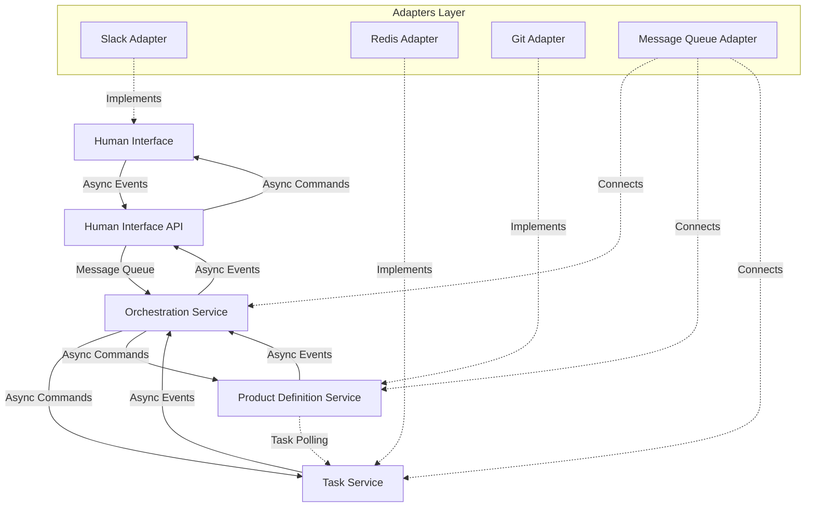
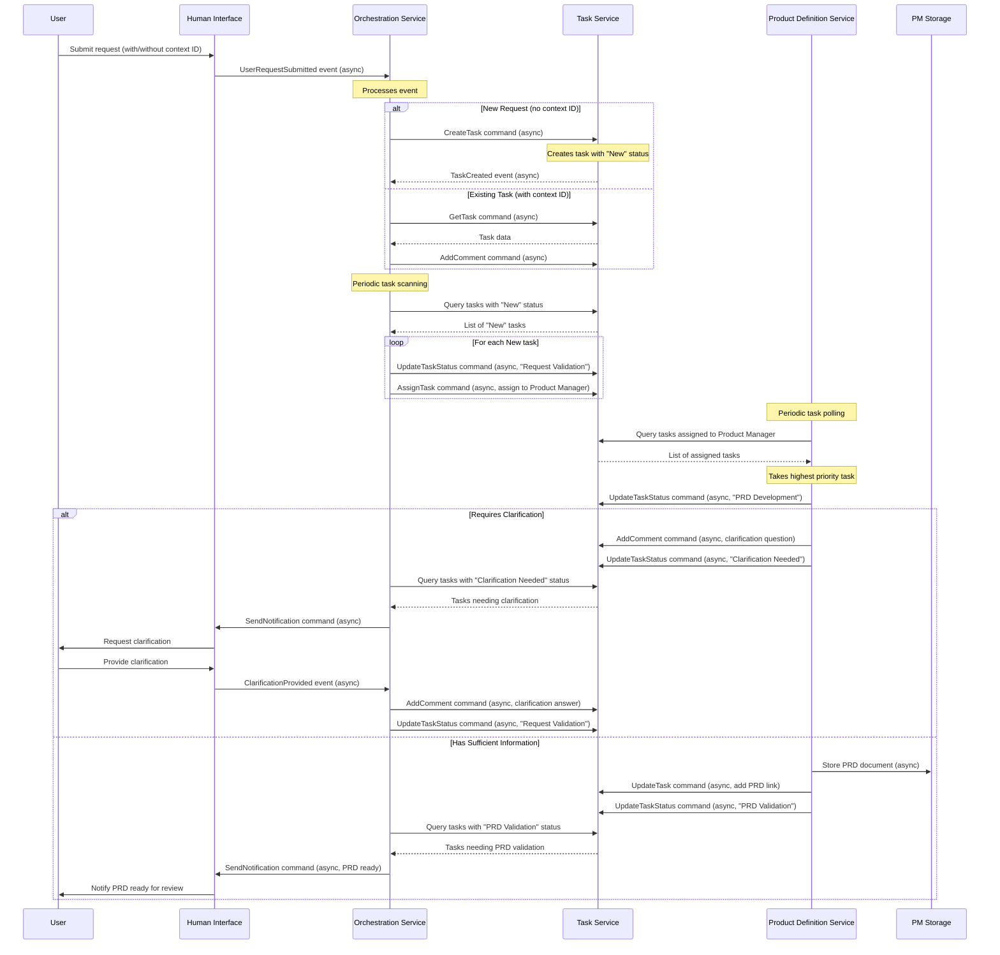

# Phase 1 Implementation: Product Refinement Workflow

## Overview

Phase 1 focuses on implementing the foundation of the AI-driven development pipeline, with particular emphasis on the product refinement workflow. This phase will establish the basic backbone of the system, implementing the Human Interface, Task Tracking System, Orchestrator Agent, and Product Manager Agent with an asynchronous, event-driven architecture to enable scalability.

## Goals

- Implement a functional product refinement workflow with asynchronous interactions
- Create system backbone with interface abstractions
- Enable PRD creation and refinement
- Establish communication between Human Interface and AI agents
- Support scalable agent deployment

## Domain Model

### Bounded Contexts

1. **Human Interaction Context**
   - Responsible for user interactions through various channels
   - Manages message formatting and notification delivery
   - Adapts external communication protocols to internal formats
   - Provides asynchronous message queue for handling requests

2. **Task Management Context**
   - Tracks the lifecycle of work items through the system
   - Manages task state transitions and history
   - Provides query capabilities for task status and attributes
   - Supports task prioritization and assignment

3. **Product Definition Context**
   - Manages structured product requirement documents
   - Handles versioning and storage of requirements
   - Processes clarification requests and responses
   - Works asynchronously on assigned tasks

4. **Orchestration Context**
   - Coordinates the overall workflow between contexts
   - Routes messages and commands to appropriate domains
   - Maintains the state machine of business processes
   - Performs periodic scanning of tasks for scheduling work

### Domain Events

The system uses an event-driven architecture with the following core events:

1. **User Request Submitted**: Triggered when a user submits a new request
2. **Task Created**: Triggered when a new task is created from a request
3. **Task Status Changed**: Triggered when a task changes status
4. **Task Assigned**: Triggered when a task is assigned to an agent
5. **Task Comment Added**: Triggered when a comment is added to a task
6. **Clarification Requested**: Triggered when more information is needed
7. **Clarification Provided**: Triggered when a user responds to clarification
8. **PRD Created**: Triggered when a product requirements document is finished
9. **PRD Updated**: Triggered when a product requirements document is modified
10. **Human Notification Needed**: Triggered when a human needs to be notified

## Task Lifecycle States

The Task entity will transition through the following states:

1. **New**: Initial state when a task is created
2. **Request Validation**: Assigned to Product Manager for initial analysis
3. **Clarification Needed**: More information is required from the user
4. **PRD Development**: Product Manager is actively working on PRD
5. **PRD Validation**: PRD is ready for human validation
6. **Approved**: PRD has been approved by human validation
7. **Rejected**: PRD has been rejected and needs revision
8. **Completed**: Task has been successfully completed
9. **Cancelled**: Task has been cancelled

## Architecture Components

### System Architecture

### Strategic Domain Design

#### Aggregates

1. **Task Aggregate**
   - Root: Task
   - Entities: Comment, TaskHistory
   - Value Objects: TaskStatus, TaskPriority, TaskAssignment
   - Invariants: Task must always have a status and priority

2. **Product Requirement Aggregate**
   - Root: ProductRequirement
   - Entities: RequirementVersion, ClarificationRequest
   - Value Objects: RequirementType, RequirementPriority
   - Invariants: A requirement must have at least one version

3. **User Interaction Aggregate**
   - Root: Conversation
   - Entities: Message, Notification
   - Value Objects: MessageType, NotificationType
   - Invariants: Messages must belong to a conversation

#### Repositories

1. **TaskRepository**: Provides access to Task aggregates
2. **ProductRequirementRepository**: Provides access to ProductRequirement aggregates
3. **ConversationRepository**: Provides access to Conversation aggregates

#### Domain Services

1. **WorkflowOrchestrationService**: Periodically scans tasks and coordinates workflow
2. **RequirementAnalysisService**: Analyzes and structures requirements
3. **ClarificationService**: Manages clarification requests and responses
4. **NotificationService**: Routes notifications to appropriate channels
5. **TaskSchedulingService**: Assigns tasks to available agents based on priority

### Tactical Design

#### Human Interface API (Port)

- **Responsibility**: Provide abstraction for user interaction
- **Key Methods**: 
  - Send message to user (async)
  - Send notification to user (async)
  - Register message handler
  - Process incoming messages (async)

#### Task Service API (Port)

- **Responsibility**: Manage task lifecycle
- **Key Methods**:
  - Create task (async)
  - Update task status (async)
  - Add comment to task (async)
  - Query tasks by status, priority, or assignment
  - Assign task to agent (async)

#### Product Definition API (Port)

- **Responsibility**: Manage product requirements
- **Key Methods**:
  - Create product requirement (async)
  - Update product requirement (async)
  - Request clarification (async)
  - Get requirement history
  - Poll for assigned tasks

#### Orchestration API (Port)

- **Responsibility**: Coordinate workflow between domains
- **Key Methods**:
  - Process incoming message (async)
  - Scan tasks for scheduling (periodic)
  - Route event to appropriate domain service (async)
  - Manage workflow state transitions (async)
  - Handle error conditions

## Asynchronous Workflow Implementation

## Implementation Plan

### Week 1-2: Domain Model Implementation

- Define bounded contexts and interfaces
- Implement core domain entities and value objects
- Define repositories and persistence abstraction
- Create initial domain services
- Implement event system for domain events
- Set up message queuing infrastructure for asynchronous communication

### Week 3-4: Agent Implementation

- Implement AI-based domain services with asynchronous processing
- Define agent responsibility boundaries
- Create agent tools and reasoning capabilities
- Implement task polling and processing logic
- Test agent decision-making processes

### Week 5-6: Workflow Integration

- Connect domain contexts through asynchronous events
- Implement periodic task scanning service
- Implement priority-based task assignment
- Create adapters for external systems
- Implement error handling and recovery mechanisms
- Set up event monitoring and logging

### Week 7-8: Refinement and Documentation

- Polish user experience
- Optimize agent prompts and tools
- Implement monitoring for async processes
- Improve error handling and edge cases
- Create comprehensive documentation
- Prepare for demo and user testing

## Success Criteria

- User can submit a request with or without context ID
- The system creates tasks and assigns appropriate status
- Orchestrator periodically scans tasks and schedules work
- Product Manager agents poll for and process assigned tasks
- The system handles clarification requests asynchronously
- PRDs are stored with proper versioning
- The system sends appropriate notifications to users
- Multiple agents can work in parallel without conflicts
- Task priorities are respected in assignment

## Next Steps

After successful implementation of Phase 1, we will proceed to:

1. Implementing Code Generation workflow in Phase 2
2. Adding human validation checkpoints for PRD approval
3. Enhancing the Product Manager Agent with more advanced capabilities
4. Adding support for additional Human Interface implementations
5. Implementing load balancing for multiple agent instances 