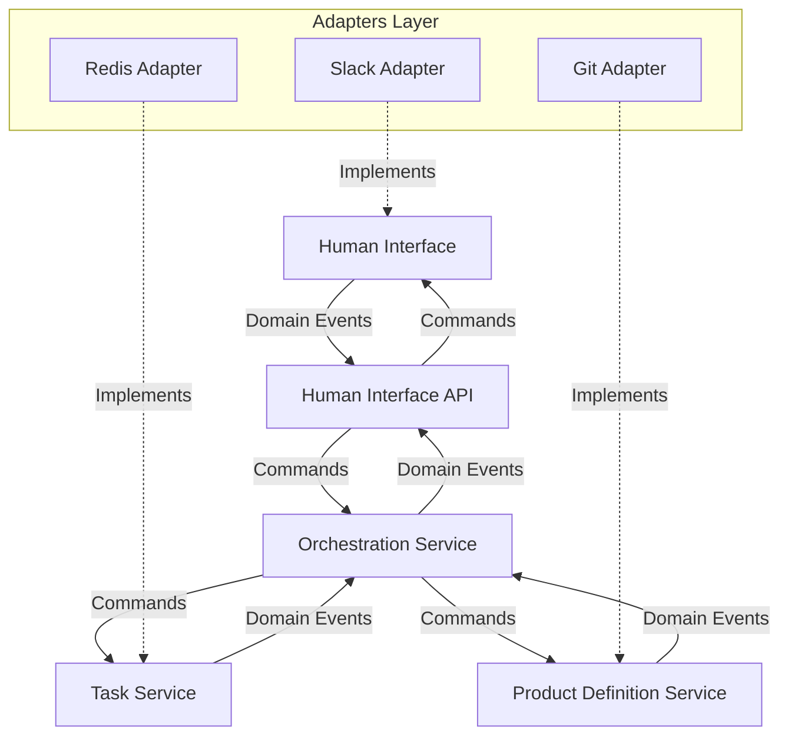
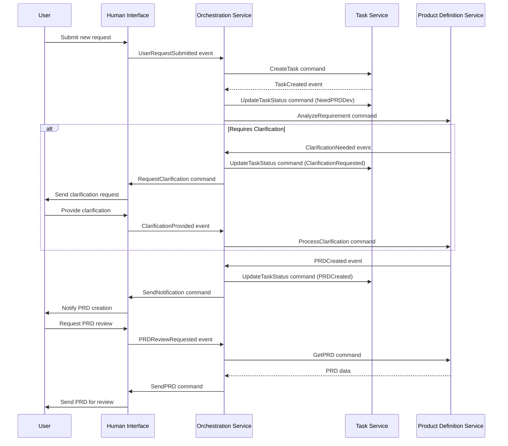

# Phase 1 Implementation: Product Refinement Workflow

## Overview

Phase 1 focuses on implementing the foundation of the AI-driven development pipeline, with particular emphasis on the product refinement workflow. This phase will establish the basic backbone of the system, implementing the Human Interface, Task Tracking System, Orchestrator Agent, and Product Manager Agent.

## Goals

- Implement a functional product refinement workflow
- Create system backbone with interface abstractions
- Enable PRD creation and refinement
- Establish communication between Human Interface and AI agents

## Domain Model

### Bounded Contexts

1. **Human Interaction Context**
   - Responsible for user interactions through various channels
   - Manages message formatting and notification delivery
   - Adapts external communication protocols to internal formats

2. **Task Management Context**
   - Tracks the lifecycle of work items through the system
   - Manages task state transitions and history
   - Provides query capabilities for task status and attributes

3. **Product Definition Context**
   - Manages structured product requirement documents
   - Handles versioning and storage of requirements
   - Processes clarification requests and responses

4. **Orchestration Context**
   - Coordinates the overall workflow between contexts
   - Routes messages and commands to appropriate domains
   - Maintains the state machine of business processes

### Domain Events

The system uses an event-driven architecture with the following core events:

1. **User Request Submitted**: Triggered when a user submits a new request
2. **Task Created**: Triggered when a new task is created from a request
3. **PRD Development Needed**: Triggered when a task requires PRD creation
4. **Clarification Requested**: Triggered when more information is needed
5. **Clarification Provided**: Triggered when a user responds to clarification
6. **PRD Created**: Triggered when a product requirements document is finished
7. **PRD Updated**: Triggered when a product requirements document is modified
8. **Task Status Updated**: Triggered when a task changes status

## Architecture Components

### System Architecture

### Strategic Domain Design

#### Aggregates

1. **Task Aggregate**
   - Root: Task
   - Entities: Comment, TaskHistory
   - Value Objects: TaskStatus, TaskPriority
   - Invariants: Task must always have a status

2. **Product Requirement Aggregate**
   - Root: ProductRequirement
   - Entities: RequirementVersion, ClarificationRequest
   - Value Objects: RequirementType, RequirementPriority
   - Invariants: A requirement must have at least one version

3. **User Interaction Aggregate**
   - Root: Conversation
   - Entities: Message, Notification
   - Value Objects: MessageType, NotificationType
   - Invariants: Messages must belong to a conversation

#### Repositories

1. **TaskRepository**: Provides access to Task aggregates
2. **ProductRequirementRepository**: Provides access to ProductRequirement aggregates
3. **ConversationRepository**: Provides access to Conversation aggregates

#### Domain Services

1. **WorkflowOrchestrationService**: Coordinates the overall workflow
2. **RequirementAnalysisService**: Analyzes and structures requirements
3. **ClarificationService**: Manages clarification requests and responses
4. **NotificationService**: Routes notifications to appropriate channels

### Tactical Design

#### Human Interface API (Port)

- **Responsibility**: Provide abstraction for user interaction
- **Key Methods**: 
  - Send message to user
  - Send notification to user
  - Register message handler
  - Start event listener

#### Task Service API (Port)

- **Responsibility**: Manage task lifecycle
- **Key Methods**:
  - Create task
  - Update task status
  - Add comment to task
  - Query tasks by status or user

#### Product Definition API (Port)

- **Responsibility**: Manage product requirements
- **Key Methods**:
  - Create product requirement
  - Update product requirement
  - Request clarification
  - Get requirement history

#### Orchestration API (Port)

- **Responsibility**: Coordinate workflow between domains
- **Key Methods**:
  - Process incoming message
  - Route event to appropriate domain service
  - Manage workflow state transitions
  - Handle error conditions

## Workflow Implementation

## Implementation Plan

### Week 1-2: Domain Model Implementation

- Define bounded contexts and interfaces
- Implement core domain entities and value objects
- Define repositories and persistence abstraction
- Create initial domain services
- Implement event system for domain events

### Week 3-4: Agent Implementation

- Implement AI-based domain services
- Define agent responsibility boundaries
- Create agent tools and reasoning capabilities
- Implement prompt engineering templates
- Test agent decision-making processes

### Week 5-6: Workflow Integration

- Connect domain contexts through events
- Implement workflow state machine
- Create adapters for external systems
- Implement error handling and recovery mechanisms
- Set up event monitoring and logging

### Week 7-8: Refinement and Documentation

- Polish user experience
- Optimize agent prompts and tools
- Improve error handling and edge cases
- Create comprehensive documentation
- Prepare for demo and user testing

## Success Criteria

- A user can submit a new request via Slack
- The system creates a task and assigns it to the Product Manager Agent
- The Product Manager Agent can create a PRD or request clarifications
- PRDs are stored with proper versioning
- The user receives notifications about task status changes
- The system maintains conversation context across interactions
- PRDs are well-structured and follow a consistent format

## Next Steps

After successful implementation of Phase 1, we will proceed to:

1. Implementing Code Generation workflow in Phase 2
2. Adding human validation checkpoints for PRD approval
3. Enhancing the Product Manager Agent with more advanced capabilities
4. Adding support for additional Human Interface implementations 