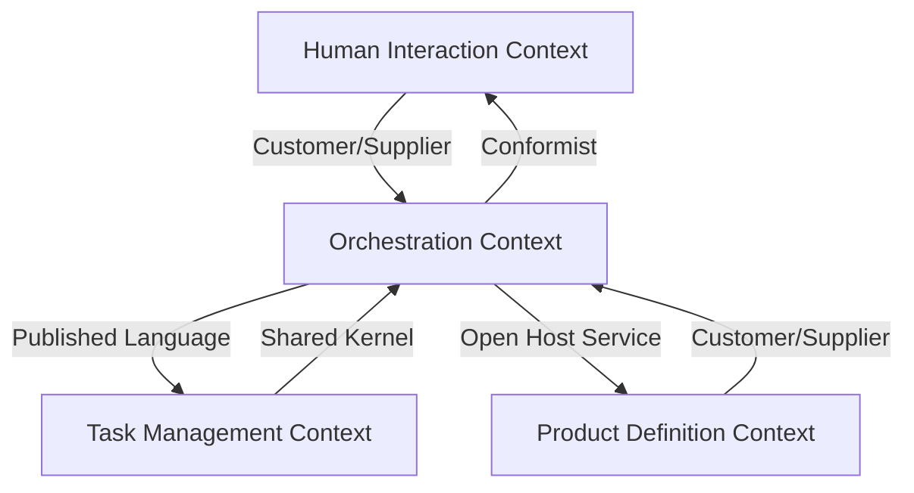
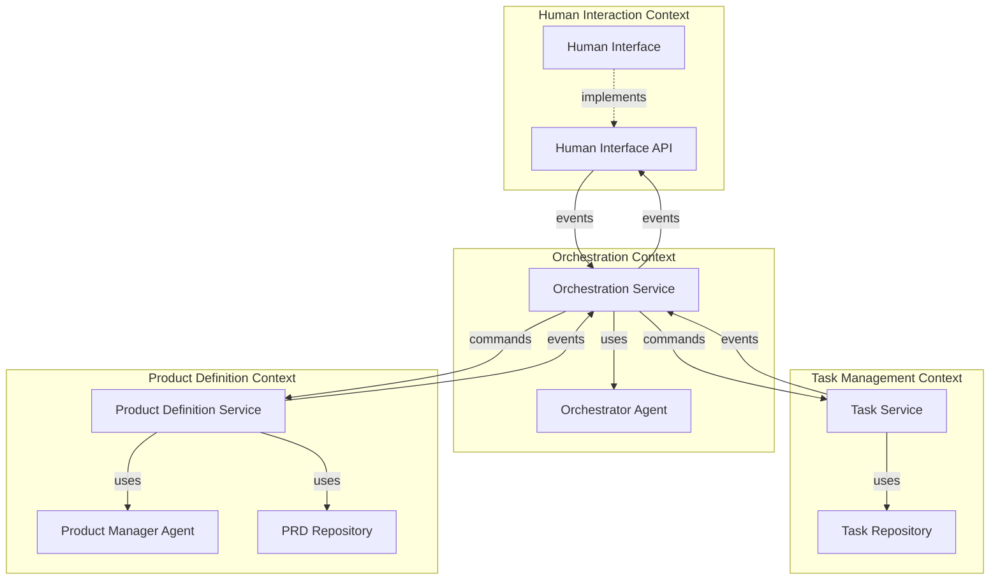
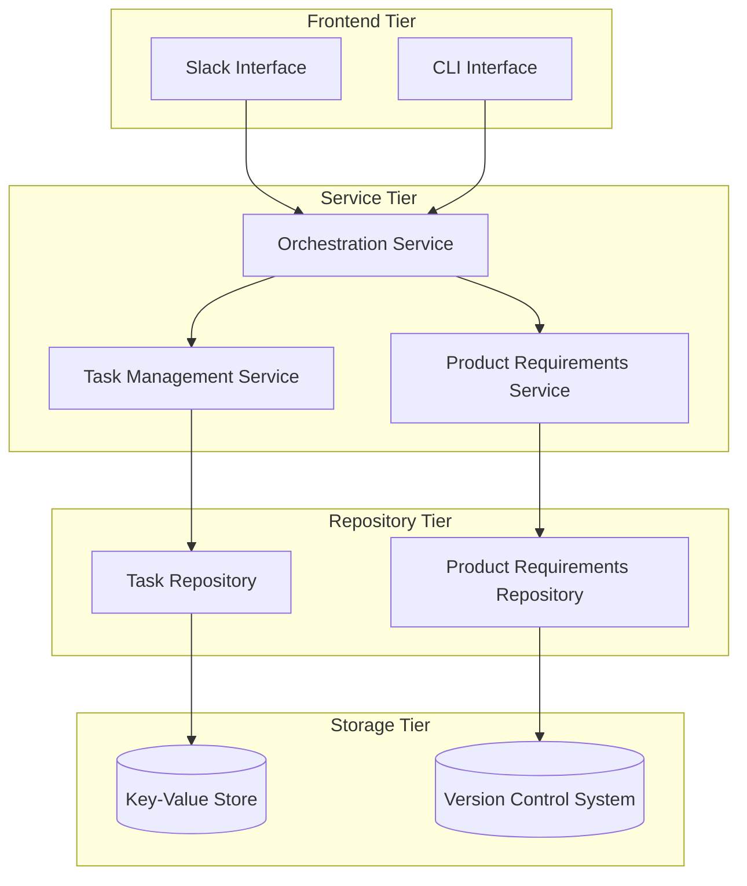
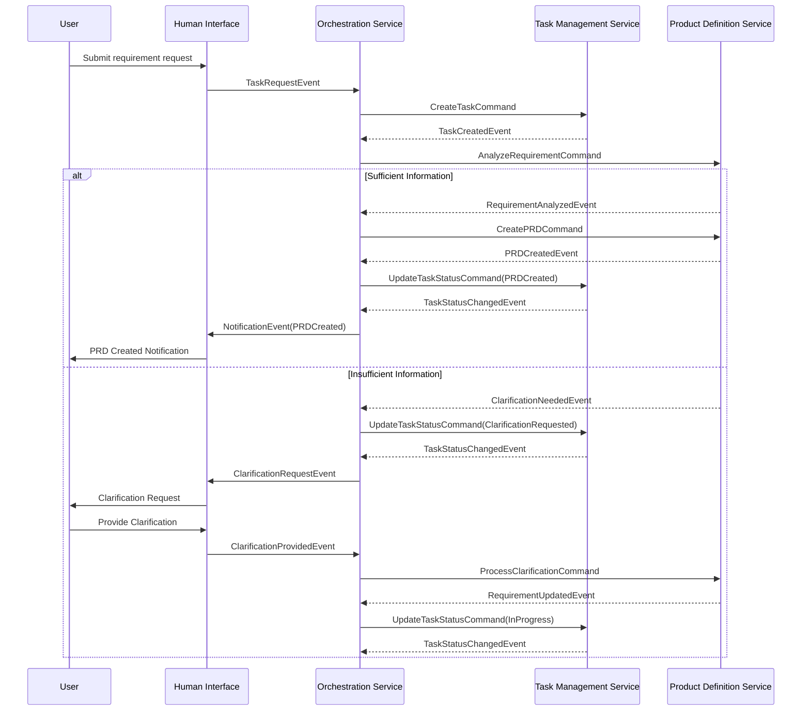

# Phase 1 Technical Specification

## Overview

This document provides detailed technical specifications for implementing Phase 1 of the AI-driven development pipeline, focusing on the product refinement workflow. The specification follows Domain-Driven Design principles to establish clear boundaries between domains and define the ubiquitous language for the system.

## Domain Model

### Bounded Contexts

The system is divided into the following bounded contexts:

1. **Human Interaction Context**
   - Responsible for all communications with human users
   - Manages message formatting and delivery
   - Handles notifications and user feedback

2. **Task Management Context**
   - Manages the lifecycle of tasks in the system
   - Responsible for status tracking and transitions
   - Maintains task metadata and comments

3. **Product Definition Context**
   - Manages the creation and refinement of product requirements
   - Handles PRD versioning and history
   - Maintains structured product specifications

4. **Orchestration Context**
   - Coordinates workflow between other bounded contexts
   - Manages the state machine of the overall process
   - Routes information between appropriate domains

### Core Domain Entities

#### Human Interaction Domain

- **Message**: A communication unit between the system and human users
- **Notification**: A structured alert to human users about system events
- **UserProfile**: Information about a human user interacting with the system
- **Channel**: A communication pathway to a specific user or group

#### Task Management Domain

- **Task**: The central work item tracking a request through the workflow
- **TaskStatus**: An enumeration of possible states for a task
- **Comment**: Feedback or notes attached to a task
- **TaskHistory**: A record of status changes and activities on a task

#### Product Definition Domain

- **ProductRequirement**: A structured definition of product specifications
- **RequirementVersion**: A specific iteration of product requirements
- **ClarificationRequest**: A question or request for additional information
- **RequirementStructure**: The organizational structure of a requirement document

#### Orchestration Domain

- **WorkflowState**: The current state of a process workflow
- **StateTransition**: A change from one workflow state to another
- **Agent**: An autonomous processor that performs specific functions
- **AgentInstruction**: A specific directive for an agent to execute

### Domain Events

The system is event-driven, with the following key domain events:

1. **TaskCreated**: Generated when a new task is initiated
2. **TaskStatusChanged**: Generated when a task transitions to a new status
3. **ClarificationRequested**: Generated when more information is needed
4. **ClarificationProvided**: Generated when a user provides additional information
5. **ProductRequirementCreated**: Generated when a new PRD is created
6. **ProductRequirementUpdated**: Generated when a PRD is modified
7. **HumanValidationRequested**: Generated when human input is needed for validation
8. **HumanValidationProvided**: Generated when a human provides validation or feedback

## Strategic Design

### Context Mapping

The following context maps define the relationships between bounded contexts:

### Aggregates

1. **Task Aggregate**
   - Root: Task
   - Entities: Comments, TaskHistory, TaskStatus
   - Value Objects: TaskPriority, TaskType
   - Invariants: Task must always have a status; Comments must be linked to a task

2. **Product Requirement Aggregate**
   - Root: ProductRequirement
   - Entities: RequirementVersion, ClarificationRequest
   - Value Objects: RequirementStructure, RequirementMetadata
   - Invariants: Product requirement must have at least one version; Versions must be sequential

3. **User Interaction Aggregate**
   - Root: UserProfile
   - Entities: Channel, NotificationPreference
   - Value Objects: Message, Notification
   - Invariants: Messages must have a destination channel; Notifications must follow user preferences

### Domain Services

1. **WorkflowCoordinationService**: Manages transitions between workflow states
2. **RequirementAnalysisService**: Analyzes natural language requirements and structures them
3. **ClarificationManagementService**: Handles the process of requesting and receiving clarifications
4. **NotificationDispatchService**: Routes notifications to appropriate channels based on events

## Tactical Design

### Repositories

1. **TaskRepository**: Provides access to task aggregates
2. **ProductRequirementRepository**: Provides access to product requirement aggregates
3. **UserProfileRepository**: Provides access to user profile aggregates

### Factories

1. **TaskFactory**: Creates well-formed task aggregates
2. **ProductRequirementFactory**: Creates well-formed product requirement aggregates
3. **NotificationFactory**: Creates appropriate notifications based on events

### Value Objects

1. **TaskIdentifier**: Unique identifier for tasks
2. **RequirementIdentifier**: Unique identifier for requirements
3. **UserIdentifier**: Unique identifier for users
4. **TaskStatus**: Status value representing the current state of a task
5. **RequirementStructure**: Structure template for requirements

## System Architecture

### Component Diagram

## Interfaces

### Human Interface API

**Purpose**: Provide domain services for human interaction

**Core Methods**:
- Send message to user
- Send notification to user
- Register message handler
- Start event listener

### Task Management API

**Purpose**: Provide domain services for task management

**Core Methods**:
- Create new task
- Update task status
- Add comment to task
- Retrieve task details
- Query tasks by criteria

### Product Definition API

**Purpose**: Provide domain services for product requirements

**Core Methods**:
- Create product requirement
- Update product requirement
- Request clarification
- Provide clarification
- Retrieve requirement versions

### Orchestration API

**Purpose**: Coordinate workflow between domains

**Core Methods**:
- Process incoming message
- Route task to appropriate agent
- Track workflow state
- Trigger state transitions
- Request human validation

## Deployment Architecture

### Component Deployment

## Event Flow

## Testing Strategy

### Domain Model Testing
- Verify domain entities enforce their invariants
- Test aggregate boundaries and relationships
- Validate domain events generation and handling

### Integration Testing
- Test bounded context interactions
- Verify event flow between contexts
- Validate repository pattern implementations

### End-to-End Testing
- Test complete workflows through all bounded contexts
- Validate state transitions
- Verify proper event propagation

## Implementation Milestones

1. **Week 1-2**: Domain model implementation and validation
2. **Week 3-4**: Bounded context APIs and repositories 
3. **Week 5-6**: System integration and workflow implementation
4. **Week 7-8**: Testing, refinement, and documentation 