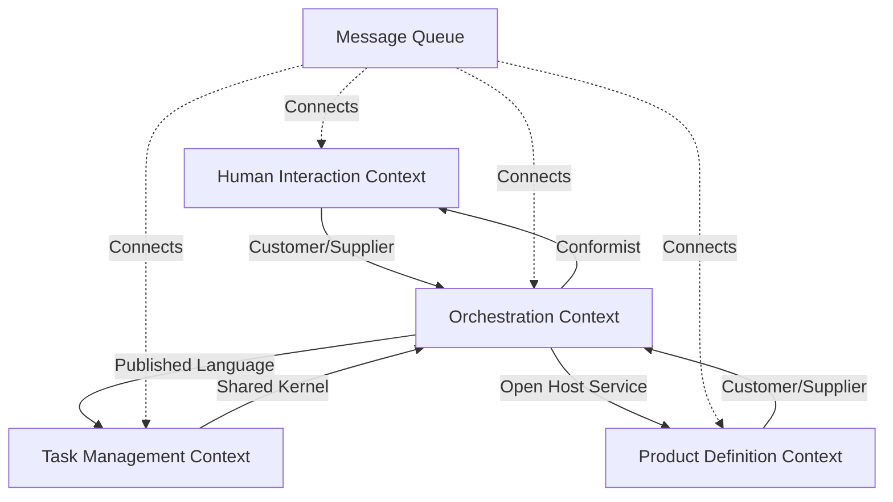
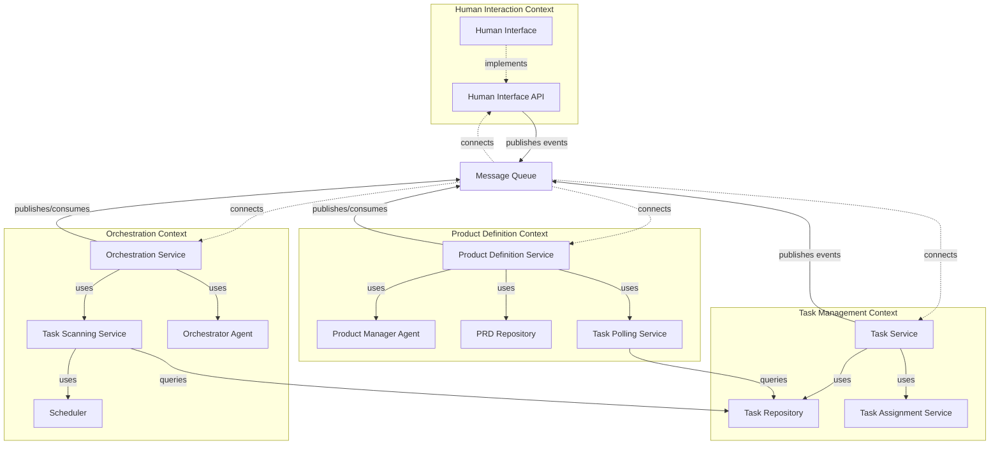
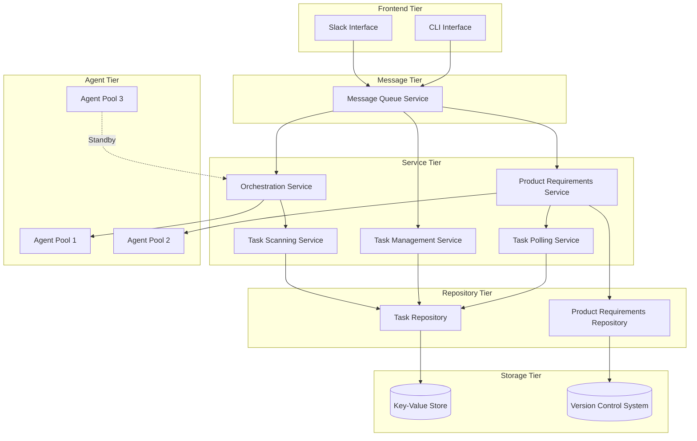
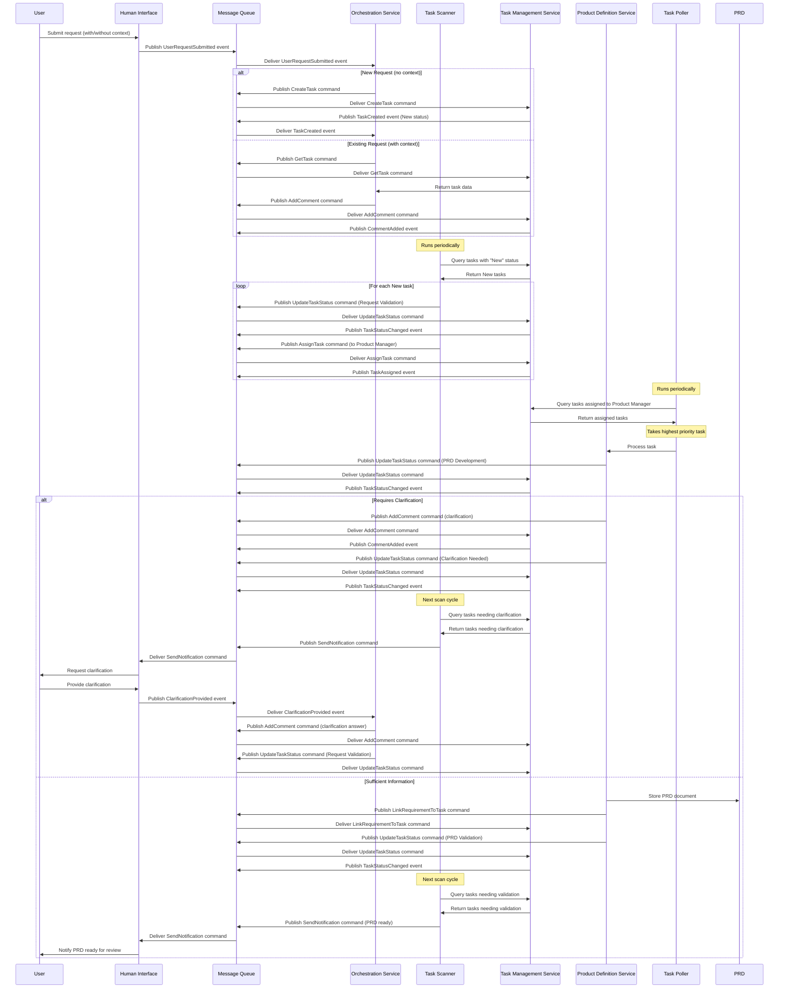

# Phase 1 Technical Specification

## Overview

This document provides detailed technical specifications for implementing Phase 1 of the AI-driven development pipeline, focusing on the product refinement workflow. The specification follows Domain-Driven Design principles to establish clear boundaries between domains and defines an asynchronous, event-driven architecture to support scalability and agent parallelization.

## Domain Model

### Bounded Contexts

The system is divided into the following bounded contexts:

1. **Human Interaction Context**
   - Responsible for all communications with human users
   - Manages message formatting and delivery
   - Handles notifications and user feedback
   - Provides asynchronous communication channels for user interactions

2. **Task Management Context**
   - Manages the lifecycle of tasks in the system
   - Responsible for status tracking and transitions
   - Maintains task metadata, comments, and assignments
   - Provides querying capabilities for task discovery and prioritization

3. **Product Definition Context**
   - Manages the creation and refinement of product requirements
   - Handles PRD versioning and history
   - Maintains structured product specifications
   - Processes assigned tasks asynchronously

4. **Orchestration Context**
   - Coordinates workflow between other bounded contexts
   - Manages the state machine of the overall process
   - Routes information between appropriate domains
   - Scans and schedules tasks periodically

### Core Domain Entities

#### Human Interaction Domain

- **Message**: A communication unit between the system and human users
- **Notification**: A structured alert to human users about system events
- **UserProfile**: Information about a human user interacting with the system
- **Channel**: A communication pathway to a specific user or group
- **RequestContext**: Context information for a user request (new or existing task)

#### Task Management Domain

- **Task**: The central work item tracking a request through the workflow
- **TaskStatus**: An enumeration of possible states for a task
- **Comment**: Feedback or notes attached to a task
- **TaskHistory**: A record of status changes and activities on a task
- **TaskAssignment**: Information about which agent is assigned to a task
- **TaskPriority**: The relative importance of a task for scheduling purposes

#### Product Definition Domain

- **ProductRequirement**: A structured definition of product specifications
- **RequirementVersion**: A specific iteration of product requirements
- **ClarificationRequest**: A question or request for additional information
- **RequirementStructure**: The organizational structure of a requirement document
- **RequirementLink**: A reference connecting a requirement to a task

#### Orchestration Domain

- **WorkflowState**: The current state of a process workflow
- **StateTransition**: A change from one workflow state to another
- **Agent**: An autonomous processor that performs specific functions
- **AgentInstruction**: A specific directive for an agent to execute
- **TaskScan**: A scheduled operation to find tasks needing attention
- **NotificationTrigger**: A condition that triggers user notification

### Task States and Transitions

The Task entity must always be in one of the following states:

1. **New**: Initial state when a task is created
   - Transitions to: Request Validation

2. **Request Validation**: Task is assigned to Product Manager for initial analysis
   - Transitions to: PRD Development, Clarification Needed, Cancelled

3. **Clarification Needed**: More information is required from the user
   - Transitions to: Request Validation

4. **PRD Development**: Product Manager is actively working on PRD
   - Transitions to: PRD Validation, Clarification Needed

5. **PRD Validation**: PRD is ready for human validation
   - Transitions to: Approved, Rejected

6. **Approved**: PRD has been approved by human validation
   - Transitions to: Completed

7. **Rejected**: PRD has been rejected and needs revision
   - Transitions to: PRD Development

8. **Completed**: Task has been successfully completed
   - Terminal state

9. **Cancelled**: Task has been cancelled
   - Terminal state

### Domain Events

The system is event-driven, with the following key domain events:

1. **UserRequestSubmitted**: Generated when a user submits a request
2. **TaskCreated**: Generated when a new task is initiated
3. **TaskStatusChanged**: Generated when a task transitions to a new status
4. **TaskAssigned**: Generated when a task is assigned to an agent
5. **TaskUnassigned**: Generated when a task assignment is removed
6. **CommentAdded**: Generated when a comment is added to a task
7. **ClarificationRequested**: Generated when more information is needed
8. **ClarificationProvided**: Generated when a user provides additional information
9. **ProductRequirementCreated**: Generated when a new PRD is created
10. **ProductRequirementUpdated**: Generated when a PRD is modified
11. **HumanValidationRequested**: Generated when human input is needed for validation
12. **HumanValidationProvided**: Generated when a human provides validation or feedback
13. **TaskScanInitiated**: Generated when the system begins scanning for tasks to process
14. **TaskScanCompleted**: Generated when a task scan cycle is completed

## Strategic Design

### Context Mapping

The following context maps define the relationships between bounded contexts:

### Aggregates

1. **Task Aggregate**
   - Root: Task
   - Entities: Comments, TaskHistory, TaskAssignment
   - Value Objects: TaskPriority, TaskType, TaskStatus
   - Invariants: 
     - Task must always have a status and priority
     - Comments must be linked to a task
     - Status transitions must follow the defined state machine

2. **Product Requirement Aggregate**
   - Root: ProductRequirement
   - Entities: RequirementVersion, ClarificationRequest
   - Value Objects: RequirementStructure, RequirementMetadata
   - Invariants: 
     - Product requirement must have at least one version
     - Versions must be sequential
     - Requirement must link to an existing task

3. **User Interaction Aggregate**
   - Root: UserProfile
   - Entities: Channel, NotificationPreference
   - Value Objects: Message, Notification, RequestContext
   - Invariants: 
     - Messages must have a destination channel
     - Notifications must follow user preferences
     - Request context must be valid (new or existing task ID)

### Domain Services

1. **TaskSchedulingService**: Periodically scans tasks and assigns them based on status and priority
2. **WorkflowCoordinationService**: Manages transitions between workflow states
3. **RequirementAnalysisService**: Analyzes natural language requirements and structures them
4. **ClarificationManagementService**: Handles the process of requesting and receiving clarifications
5. **NotificationDispatchService**: Routes notifications to appropriate channels based on events
6. **AgentPoolService**: Manages the pool of available agents for task assignment

## Tactical Design

### Repositories

1. **TaskRepository**: 
   - Provides access to task aggregates
   - Supports querying by status, assignment, and priority
   - Enables optimistic concurrency for parallel agent access

2. **ProductRequirementRepository**: 
   - Provides access to product requirement aggregates
   - Supports versioning and retrieval by task ID
   - Handles concurrent updates to requirements

3. **UserProfileRepository**: 
   - Provides access to user profile aggregates
   - Manages notification preferences
   - Supports channel management for communication

### Factories

1. **TaskFactory**: Creates well-formed task aggregates with proper initial state
2. **ProductRequirementFactory**: Creates well-formed product requirement aggregates
3. **NotificationFactory**: Creates appropriate notifications based on events and user preferences

### Value Objects

1. **TaskIdentifier**: Unique identifier for tasks
2. **RequirementIdentifier**: Unique identifier for requirements
3. **UserIdentifier**: Unique identifier for users
4. **TaskStatus**: Status value representing the current state of a task
5. **RequirementStructure**: Structure template for requirements
6. **TaskPriority**: Value indicating the relative importance of a task
7. **AssignmentStatus**: Status of a task assignment (assigned, unassigned, in-progress)

## System Architecture

### Component Diagram

## Asynchronous Processing

### Message Queue

The system uses a message queue to enable asynchronous processing:

1. **Event Bus**: Central message broker for all domain events
2. **Command Queue**: Prioritized queue for commands to be processed
3. **Task Assignment Queue**: Specialized queue for task assignments to agents
4. **Notification Queue**: Queue for user notifications

### Periodic Task Scanning

The Orchestration Context includes a Task Scanning Service that:

1. Runs at configurable intervals (e.g., every 5 minutes)
2. Queries the Task Repository for tasks in specific states
3. For "New" tasks:
   - Updates status to "Request Validation"
   - Assigns to Product Manager agent pool
   - Publishes TaskAssigned event
4. For tasks needing notification:
   - Identifies tasks requiring human interaction
   - Triggers appropriate notifications

### Agent Task Polling

The Product Definition Context includes a Task Polling Service that:

1. Periodically polls for tasks assigned to Product Manager agents
2. Selects tasks based on priority and other criteria
3. Processes the highest priority task
4. Updates task status based on processing results

## Interfaces

### Human Interface API

**Purpose**: Provide domain services for human interaction

**Core Methods**:
- Send message to user (async)
- Send notification to user (async)
- Register message handler
- Process incoming messages (async)
- Parse request context (new or existing task)

### Task Management API

**Purpose**: Provide domain services for task management

**Core Methods**:
- Create new task (async)
- Update task status (async)
- Add comment to task (async)
- Retrieve task details
- Query tasks by criteria (status, assignment, priority)
- Assign task to agent (async)
- Unassign task from agent (async)
- Update task priority (async)

### Product Definition API

**Purpose**: Provide domain services for product requirements

**Core Methods**:
- Create product requirement (async)
- Update product requirement (async)
- Request clarification (async)
- Provide clarification response (async)
- Retrieve requirement versions
- Link requirement to task (async)
- Poll for assigned tasks
- Process assigned task (async)

### Orchestration API

**Purpose**: Coordinate workflow between domains

**Core Methods**:
- Process incoming message (async)
- Schedule task scanning (periodic)
- Scan for actionable tasks (async)
- Route event to appropriate domain service (async)
- Trigger state transitions (async)
- Request human validation (async)
- Process validation response (async)

## Deployment Architecture

### Component Deployment

## Event Flow

## Testing Strategy

### Domain Model Testing
- Verify domain entities enforce their invariants
- Test aggregate boundaries and relationships
- Validate domain events generation and handling
- Test state transitions against the defined state machine

### Asynchronous Processing Testing
- Test message publishing and consumption
- Verify event handling and routing
- Test task scanning and scheduling
- Validate task polling and assignment

### Integration Testing
- Test bounded context interactions via message queue
- Verify event flow between contexts
- Validate repository pattern implementations
- Test concurrent access patterns

### End-to-End Testing
- Test complete workflows through all bounded contexts
- Validate state transitions
- Verify proper event propagation
- Test parallel agent processing

## Implementation Milestones

1. **Week 1-2**: Domain model implementation and validation
   - Implement core entities and value objects
   - Create event definitions and message contracts
   - Set up message queue infrastructure
   - Implement repository interfaces

2. **Week 3-4**: Bounded context APIs and repositories 
   - Implement task management services
   - Create product definition services
   - Develop human interface adapters
   - Implement orchestration services

3. **Week 5-6**: System integration and workflow implementation
   - Implement task scanning service
   - Create task polling service
   - Develop agent pools and assignment
   - Implement asynchronous event handling

4. **Week 7-8**: Testing, refinement, and documentation 
   - Test parallel agent processing
   - Optimize task assignment algorithms
   - Refine notification triggers
   - Create monitoring and troubleshooting tools 