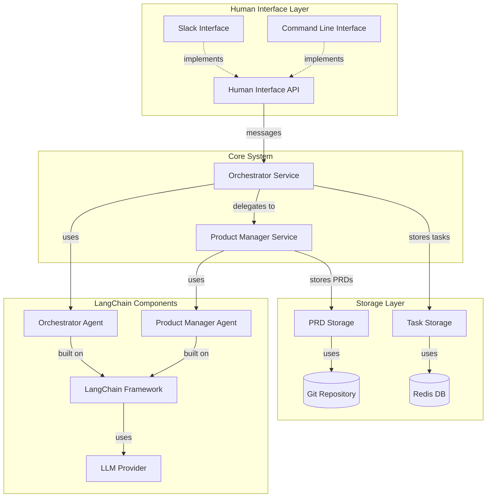

# Phase 1 Technical Specification

## Overview

This document provides detailed technical specifications for implementing Phase 1 of the AI-driven development pipeline, focusing on the product refinement workflow using LangChain.

## System Architecture

### Component Diagram



## Component Specifications

### Human Interface API

**Purpose**: Provide an abstraction for user interaction

**Interface Definition**:
```python
class HumanInterface(ABC):
    @abstractmethod
    def send_message(self, user_id: str, message: str) -> bool:
        """Send a message to a user"""
        pass
        
    @abstractmethod
    def send_notification(self, user_id: str, notification_type: str, data: dict) -> bool:
        """Send a notification to a user"""
        pass
        
    @abstractmethod
    def register_message_handler(self, handler: Callable[[str, str], None]) -> None:
        """Register a callback for incoming messages"""
        pass
```

**SlackInterface Implementation**:
```python
class SlackInterface(HumanInterface):
    def __init__(self, slack_token: str, app_token: str):
        self.client = WebClient(token=slack_token)
        self.app = App(token=app_token)
        self.message_handlers = []
        
    def send_message(self, user_id: str, message: str) -> bool:
        try:
            response = self.client.chat_postMessage(
                channel=user_id,
                text=message
            )
            return response["ok"]
        except SlackApiError:
            return False
            
    def send_notification(self, user_id: str, notification_type: str, data: dict) -> bool:
        # Format notification based on type
        blocks = self._format_notification(notification_type, data)
        try:
            response = self.client.chat_postMessage(
                channel=user_id,
                blocks=blocks
            )
            return response["ok"]
        except SlackApiError:
            return False
            
    def register_message_handler(self, handler: Callable[[str, str], None]) -> None:
        self.message_handlers.append(handler)
        
    def _format_notification(self, notification_type: str, data: dict) -> List[dict]:
        # Create appropriate Slack blocks based on notification type
        # ...
```

### Task Storage API

**Purpose**: Store and manage task information

**Interface Definition**:
```python
class TaskStorage(ABC):
    @abstractmethod
    def create_task(self, title: str, description: str, user_id: str) -> str:
        """Create a new task and return task_id"""
        pass
        
    @abstractmethod
    def update_task_status(self, task_id: str, status: str) -> bool:
        """Update task status"""
        pass
        
    @abstractmethod
    def add_comment(self, task_id: str, comment: str, author: str) -> bool:
        """Add a comment to a task"""
        pass
        
    @abstractmethod
    def get_task(self, task_id: str) -> dict:
        """Get task details"""
        pass
        
    @abstractmethod
    def query_tasks(self, status: str = None, user_id: str = None) -> List[dict]:
        """Query tasks by criteria"""
        pass
```

**RedisTaskStorage Implementation**:
```python
class RedisTaskStorage(TaskStorage):
    def __init__(self, redis_url: str):
        self.redis = redis.from_url(redis_url)
        
    def create_task(self, title: str, description: str, user_id: str) -> str:
        task_id = str(uuid.uuid4())
        task = {
            "id": task_id,
            "title": title,
            "description": description,
            "user_id": user_id,
            "status": "created",
            "created_at": datetime.now().isoformat(),
            "updated_at": datetime.now().isoformat(),
            "comments": []
        }
        
        self.redis.hset(f"task:{task_id}", mapping=task)
        self.redis.sadd("tasks", task_id)
        self.redis.sadd(f"tasks:user:{user_id}", task_id)
        self.redis.sadd(f"tasks:status:created", task_id)
        
        return task_id
        
    def update_task_status(self, task_id: str, status: str) -> bool:
        # Implementation details...
        
    def add_comment(self, task_id: str, comment: str, author: str) -> bool:
        # Implementation details...
        
    def get_task(self, task_id: str) -> dict:
        # Implementation details...
        
    def query_tasks(self, status: str = None, user_id: str = None) -> List[dict]:
        # Implementation details...
```

### PRD Storage API

**Purpose**: Store and manage PRD documents

**Interface Definition**:
```python
class PRDStorage(ABC):
    @abstractmethod
    def create_prd(self, task_id: str, title: str, content: str) -> str:
        """Create a new PRD and return prd_id"""
        pass
        
    @abstractmethod
    def update_prd(self, prd_id: str, content: str) -> bool:
        """Update PRD content"""
        pass
        
    @abstractmethod
    def get_prd(self, prd_id: str) -> dict:
        """Get PRD details and content"""
        pass
        
    @abstractmethod
    def get_prd_history(self, prd_id: str) -> List[dict]:
        """Get PRD version history"""
        pass
```

**GitPRDStorage Implementation**:
```python
class GitPRDStorage(PRDStorage):
    def __init__(self, repo_path: str, remote_url: str = None):
        self.repo_path = repo_path
        if not os.path.exists(os.path.join(repo_path, '.git')):
            self.repo = git.Repo.init(repo_path)
            if remote_url:
                self.repo.create_remote('origin', remote_url)
        else:
            self.repo = git.Repo(repo_path)
            
    def create_prd(self, task_id: str, title: str, content: str) -> str:
        prd_id = str(uuid.uuid4())
        file_path = os.path.join(self.repo_path, f"prd_{prd_id}.md")
        
        with open(file_path, 'w') as f:
            f.write(f"# {title}\n\n")
            f.write(f"Task ID: {task_id}\n\n")
            f.write(content)
            
        self.repo.git.add(file_path)
        self.repo.git.commit(m=f"Create PRD: {title}")
        
        return prd_id
        
    def update_prd(self, prd_id: str, content: str) -> bool:
        # Implementation details...
        
    def get_prd(self, prd_id: str) -> dict:
        # Implementation details...
        
    def get_prd_history(self, prd_id: str) -> List[dict]:
        # Implementation details...
```

## LangChain Implementation

### Orchestrator Agent

**Purpose**: Route messages and manage workflow

**Implementation**:
```python
class OrchestratorAgent:
    def __init__(self, llm, task_storage: TaskStorage, product_manager_agent):
        self.llm = llm
        self.task_storage = task_storage
        self.product_manager_agent = product_manager_agent
        
        # Define LangChain tools
        self.tools = [
            Tool(
                name="create_task",
                func=self._create_task,
                description="Create a new task with a title and description"
            ),
            Tool(
                name="update_task_status",
                func=self._update_task_status,
                description="Update the status of a task"
            ),
            Tool(
                name="get_task",
                func=self._get_task,
                description="Get task details"
            ),
            Tool(
                name="assign_to_product_manager",
                func=self._assign_to_product_manager,
                description="Assign a task to the Product Manager for PRD creation"
            )
        ]
        
        # Create LangChain agent
        self.agent = initialize_agent(
            tools=self.tools,
            llm=self.llm,
            agent=AgentType.STRUCTURED_CHAT_ZERO_SHOT_REACT_DESCRIPTION,
            verbose=True
        )
        
    def process_message(self, user_id: str, message: str) -> str:
        """Process an incoming message and determine the appropriate action"""
        # Check if this is a new request or related to existing task
        return self.agent.run(
            f"Process this message from user {user_id}: {message}. " +
            "Determine if this is a new request or related to an existing task. " +
            "If it's a new request, create a task and assign it to the Product Manager. " +
            "If it's related to an existing task, update the task status accordingly."
        )
        
    def _create_task(self, title: str, description: str, user_id: str) -> str:
        """Tool to create a new task"""
        task_id = self.task_storage.create_task(title, description, user_id)
        return f"Created task {task_id}: {title}"
        
    def _update_task_status(self, task_id: str, status: str) -> str:
        """Tool to update task status"""
        success = self.task_storage.update_task_status(task_id, status)
        if success:
            return f"Updated task {task_id} status to {status}"
        return f"Failed to update task {task_id}"
        
    def _get_task(self, task_id: str) -> str:
        """Tool to get task details"""
        task = self.task_storage.get_task(task_id)
        return json.dumps(task)
        
    def _assign_to_product_manager(self, task_id: str) -> str:
        """Tool to assign a task to the Product Manager"""
        task = self.task_storage.get_task(task_id)
        self.task_storage.update_task_status(task_id, "NeedPRDDev")
        result = self.product_manager_agent.process_task(task)
        return result
```

### Product Manager Agent

**Purpose**: Create and refine PRD documents

**Implementation**:
```python
class ProductManagerAgent:
    def __init__(self, llm, task_storage: TaskStorage, prd_storage: PRDStorage):
        self.llm = llm
        self.task_storage = task_storage
        self.prd_storage = prd_storage
        
        # Define LangChain tools
        self.tools = [
            Tool(
                name="create_prd",
                func=self._create_prd,
                description="Create a new PRD document for a task"
            ),
            Tool(
                name="request_clarification",
                func=self._request_clarification,
                description="Request clarification from the user about requirements"
            ),
            Tool(
                name="update_prd",
                func=self._update_prd,
                description="Update an existing PRD document"
            )
        ]
        
        # Define PRD template with LangChain prompt template
        self.prd_template = PromptTemplate(
            input_variables=["title", "description"],
            template="""
            # {title} - Product Requirements Document
            
            ## Overview
            
            {description}
            
            ## Goals
            
            [Describe the primary goals of this feature/product]
            
            ## User Stories
            
            [List the key user stories]
            
            ## Functional Requirements
            
            [Detail the functional requirements]
            
            ## Non-Functional Requirements
            
            [Detail performance, security, and other non-functional requirements]
            
            ## Success Metrics
            
            [Define how success will be measured]
            """
        )
        
        # Create LangChain agent
        self.agent = initialize_agent(
            tools=self.tools,
            llm=self.llm,
            agent=AgentType.STRUCTURED_CHAT_ZERO_SHOT_REACT_DESCRIPTION,
            verbose=True
        )
        
    def process_task(self, task: dict) -> str:
        """Process a task to create or update a PRD"""
        return self.agent.run(
            f"Process this task to create a PRD: {json.dumps(task)}. " +
            "If you have enough information, create a PRD. " +
            "If you need clarification, request it from the user."
        )
        
    def _create_prd(self, task_id: str, title: str, content: str) -> str:
        """Tool to create a new PRD"""
        prd_id = self.prd_storage.create_prd(task_id, title, content)
        self.task_storage.update_task_status(task_id, "PRDCreated")
        return f"Created PRD {prd_id} for task {task_id}"
        
    def _request_clarification(self, task_id: str, question: str) -> str:
        """Tool to request clarification"""
        self.task_storage.add_comment(task_id, f"Clarification needed: {question}", "ProductManagerAgent")
        self.task_storage.update_task_status(task_id, "ClarificationRequested")
        return f"Requested clarification for task {task_id}: {question}"
        
    def _update_prd(self, prd_id: str, content: str) -> str:
        """Tool to update a PRD"""
        success = self.prd_storage.update_prd(prd_id, content)
        if success:
            return f"Updated PRD {prd_id}"
        return f"Failed to update PRD {prd_id}"
        
    def generate_prd_from_description(self, title: str, description: str) -> str:
        """Use LLM to generate a PRD from a description"""
        chain = LLMChain(llm=self.llm, prompt=self.prd_template)
        return chain.run(title=title, description=description)
```

## Service Integration

### Orchestrator Service

**Purpose**: Central coordination service

**Implementation**:
```python
class OrchestratorService:
    def __init__(
        self, 
        human_interface: HumanInterface, 
        task_storage: TaskStorage,
        orchestrator_agent: OrchestratorAgent
    ):
        self.human_interface = human_interface
        self.task_storage = task_storage
        self.orchestrator_agent = orchestrator_agent
        
        # Register message handler
        self.human_interface.register_message_handler(self.handle_message)
        
    def handle_message(self, user_id: str, message: str) -> None:
        """Handle incoming messages from users"""
        try:
            # Process message with Orchestrator Agent
            response = self.orchestrator_agent.process_message(user_id, message)
            
            # Send response back to user
            self.human_interface.send_message(user_id, response)
        except Exception as e:
            # Handle errors
            error_msg = f"Error processing message: {str(e)}"
            self.human_interface.send_message(user_id, error_msg)
```

### Product Manager Service

**Purpose**: Service for PRD creation and management

**Implementation**:
```python
class ProductManagerService:
    def __init__(
        self,
        task_storage: TaskStorage,
        prd_storage: PRDStorage,
        product_manager_agent: ProductManagerAgent,
        human_interface: HumanInterface
    ):
        self.task_storage = task_storage
        self.prd_storage = prd_storage
        self.product_manager_agent = product_manager_agent
        self.human_interface = human_interface
        
    def process_task(self, task_id: str) -> None:
        """Process a task to create or update a PRD"""
        try:
            # Get task details
            task = self.task_storage.get_task(task_id)
            
            # Process with Product Manager Agent
            result = self.product_manager_agent.process_task(task)
            
            # Notify user
            self.human_interface.send_notification(
                task["user_id"],
                "prd_update",
                {"task_id": task_id, "result": result}
            )
        except Exception as e:
            # Handle errors
            error_msg = f"Error processing task {task_id}: {str(e)}"
            self.task_storage.add_comment(task_id, error_msg, "ProductManagerService")
```

## Deployment Configuration

### Docker Configuration

**docker-compose.yml**:
```yaml
version: '3'
services:
  redis:
    image: redis:latest
    ports:
      - "6379:6379"
    volumes:
      - redis-data:/data
    
  orchestrator:
    build:
      context: .
      dockerfile: Dockerfile.orchestrator
    environment:
      - REDIS_URL=redis://redis:6379
      - SLACK_TOKEN=${SLACK_TOKEN}
      - SLACK_APP_TOKEN=${SLACK_APP_TOKEN}
      - OPENAI_API_KEY=${OPENAI_API_KEY}
    depends_on:
      - redis
    
  product-manager:
    build:
      context: .
      dockerfile: Dockerfile.product-manager
    environment:
      - REDIS_URL=redis://redis:6379
      - GIT_REPO_PATH=/app/data/prd-repo
      - OPENAI_API_KEY=${OPENAI_API_KEY}
    volumes:
      - ./data/prd-repo:/app/data/prd-repo
    depends_on:
      - redis

volumes:
  redis-data:
```

### Main Application Entry Point

**app.py**:
```python
import os
from langchain.llms import OpenAI
from langchain.chat_models import ChatOpenAI
from components.human_interface import SlackInterface
from components.task_storage import RedisTaskStorage
from components.prd_storage import GitPRDStorage
from agents.orchestrator_agent import OrchestratorAgent
from agents.product_manager_agent import ProductManagerAgent
from services.orchestrator_service import OrchestratorService
from services.product_manager_service import ProductManagerService

def main():
    # Initialize LLM
    llm = ChatOpenAI(temperature=0.2)
    
    # Initialize storage
    redis_url = os.environ.get("REDIS_URL", "redis://localhost:6379")
    git_repo_path = os.environ.get("GIT_REPO_PATH", "./data/prd-repo")
    
    task_storage = RedisTaskStorage(redis_url)
    prd_storage = GitPRDStorage(git_repo_path)
    
    # Initialize human interface
    slack_token = os.environ.get("SLACK_TOKEN")
    slack_app_token = os.environ.get("SLACK_APP_TOKEN")
    human_interface = SlackInterface(slack_token, slack_app_token)
    
    # Initialize agents
    product_manager_agent = ProductManagerAgent(llm, task_storage, prd_storage)
    orchestrator_agent = OrchestratorAgent(llm, task_storage, product_manager_agent)
    
    # Initialize services
    product_manager_service = ProductManagerService(
        task_storage,
        prd_storage,
        product_manager_agent,
        human_interface
    )
    
    orchestrator_service = OrchestratorService(
        human_interface,
        task_storage,
        orchestrator_agent
    )
    
    # Start Slack event listener
    human_interface.start_event_listener()
    
if __name__ == "__main__":
    main()
```

## Testing Strategy

### Unit Tests

- Test each component in isolation with mock dependencies
- Test agent prompt templates and tool functionality
- Test storage implementations with test databases

### Integration Tests

- Test interaction between components
- Test workflow with simulated user inputs
- Verify state transitions and data persistence

### End-to-End Tests

- Test complete workflow from user input to PRD creation
- Verify notification delivery
- Test error handling and recovery

## Implementation Milestones

1. **Week 1**: Set up project structure and implement storage APIs
2. **Week 2**: Implement human interface with Slack adapter
3. **Week 3**: Implement Orchestrator Agent with LangChain
4. **Week 4**: Implement Product Manager Agent with LangChain
5. **Week 5**: Integrate components and implement services
6. **Week 6**: Test and refine workflow
7. **Week 7**: Add error handling and improve robustness
8. **Week 8**: Documentation and final testing 