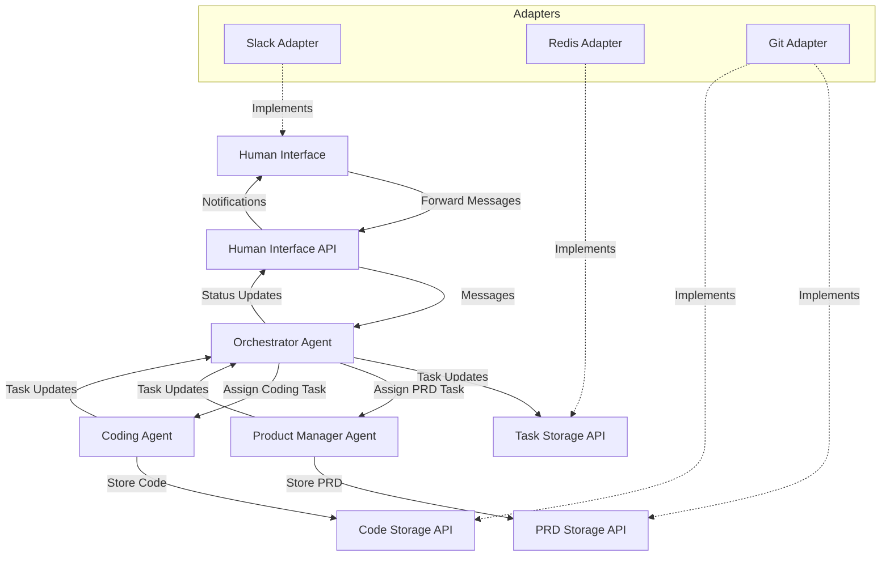
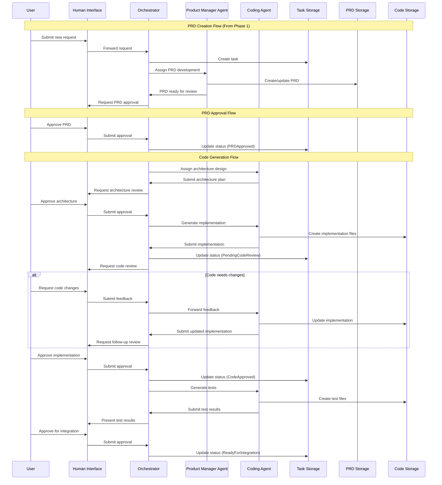

# Phase 2 Implementation: Code Generation Workflow

## Overview

Phase 2 builds upon the foundation established in Phase 1 by implementing the code generation workflow. This phase focuses on enhancing the Orchestrator Agent and adding the Coding Agent to generate implementation code based on approved PRDs.

## Goals

- Implement the code generation workflow
- Enhance PRD validation with human checkpoints
- Create a flexible, extensible Coding Agent
- Implement code storage and versioning

## Architecture Components

### System Architecture



### New/Enhanced Components

1. **Coding Agent**
   - Specialized agent for code generation
   - Analyzes structured PRDs
   - Generates implementation code
   - Creates unit tests for generated code
   - Handles code review feedback

2. **Code Storage API**
   - Abstract interface for code storage
   - Support for versioning and branching
   - Code structure and organization
   - Integration with Git or other VCS

3. **Enhanced Orchestrator Agent**
   - Support for code generation workflow
   - Human validation checkpoint management
   - State tracking for development tasks
   - Error handling and recovery logic

4. **Enhanced Human Interface**
   - Code review interface
   - PRD approval screens
   - More detailed notifications
   - Implementation plan review

## Implementation Details

### Enhanced Workflow



### LangChain Implementation

1. **Coding Agent Implementation**
   - Use LangChain's agent framework for the Coding Agent
   - Create specialized prompts for different coding tasks
   - Implement code generation tools with appropriate constraints
   - Enable context management for large codebases

2. **Enhanced Orchestrator Implementation**
   - Add workflow rules for code generation
   - Implement validation checkpoint logic
   - Create feedback routing mechanisms
   - Add support for multi-agent collaboration

3. **Human Validation Logic**
   - Implement checkpoint decision logic
   - Create approval/rejection handling
   - Enable feedback collection and routing
   - Add support for partial approvals

### API Enhancements

#### Enhanced Task Storage API

```python
class TaskStorage:
    # Phase 1 methods...
    
    def add_artifact(self, task_id: str, artifact_type: str, artifact_id: str) -> bool:
        """Associate an artifact with a task"""
        pass
        
    def get_task_artifacts(self, task_id: str, artifact_type: str = None) -> List[dict]:
        """Get artifacts associated with a task"""
        pass
        
    def add_approval(self, task_id: str, approval_type: str, approver: str, comments: str = None) -> bool:
        """Add an approval record to a task"""
        pass
        
    def get_task_approvals(self, task_id: str) -> List[dict]:
        """Get approval records for a task"""
        pass
```

#### Code Storage API

```python
class CodeStorage:
    def create_repository(self, name: str, description: str) -> str:
        """Create a new code repository and return repo_id"""
        pass
        
    def commit_files(self, repo_id: str, files: Dict[str, str], message: str) -> str:
        """Commit files to repository and return commit_id"""
        pass
        
    def get_file(self, repo_id: str, file_path: str, ref: str = "main") -> str:
        """Get file content from repository"""
        pass
        
    def get_directory(self, repo_id: str, dir_path: str, ref: str = "main") -> List[dict]:
        """Get directory listing from repository"""
        pass
        
    def create_branch(self, repo_id: str, branch_name: str, from_ref: str = "main") -> bool:
        """Create a new branch in repository"""
        pass
        
    def merge_branch(self, repo_id: str, source_branch: str, target_branch: str = "main") -> bool:
        """Merge branches in repository"""
        pass
```

#### Enhanced Human Interface API

```python
class HumanInterface:
    # Phase 1 methods...
    
    def request_approval(self, user_id: str, approval_type: str, data: dict) -> bool:
        """Request approval from a user"""
        pass
        
    def display_code_diff(self, user_id: str, old_version: str, new_version: str) -> bool:
        """Display code differences to a user"""
        pass
        
    def display_architecture(self, user_id: str, architecture_data: dict) -> bool:
        """Display architecture diagram to a user"""
        pass
        
    def register_approval_handler(self, handler: Callable[[str, str, bool, str], None]) -> None:
        """Register a callback for approval responses"""
        pass
```

## Implementation Plan

### Week 1-2: Enhanced Infrastructure

- Enhance task storage with approval and artifact support
- Implement code storage API with Git adapter
- Update human interface API with approval and code review support
- Enhance orchestrator to support validation checkpoints
- Create tests for enhanced components

### Week 3-4: Coding Agent Implementation

- Implement Coding Agent using LangChain
- Create architecture design capabilities
- Implement code generation logic
- Develop test generation capabilities
- Create code review feedback handling

### Week 5-6: Workflow Integration

- Connect components in the enhanced workflow
- Implement code generation state management
- Create human validation checkpoint flows
- Add error handling and recovery logic
- Set up end-to-end tests

### Week 7-8: Refinement and Documentation

- Optimize code generation capabilities
- Improve validation checkpoint UX
- Enhance error handling for code generation issues
- Create comprehensive documentation
- Prepare for demo and user acceptance testing

## Success Criteria

- A user can review and approve a PRD
- The system can generate architecture plans and implementation code
- Code is stored in a version control system with proper organization
- The user can review and provide feedback on generated code
- The Coding Agent can adapt based on feedback
- Tests are generated for implemented code
- The entire workflow from requirements to code is tracked

## Next Steps

After successful implementation of Phase 2, we will proceed to:

1. Adding advanced AI capabilities in Phase 3
2. Implementing deployment pipelines
3. Adding analytics and monitoring
4. Scaling the system for larger workloads 