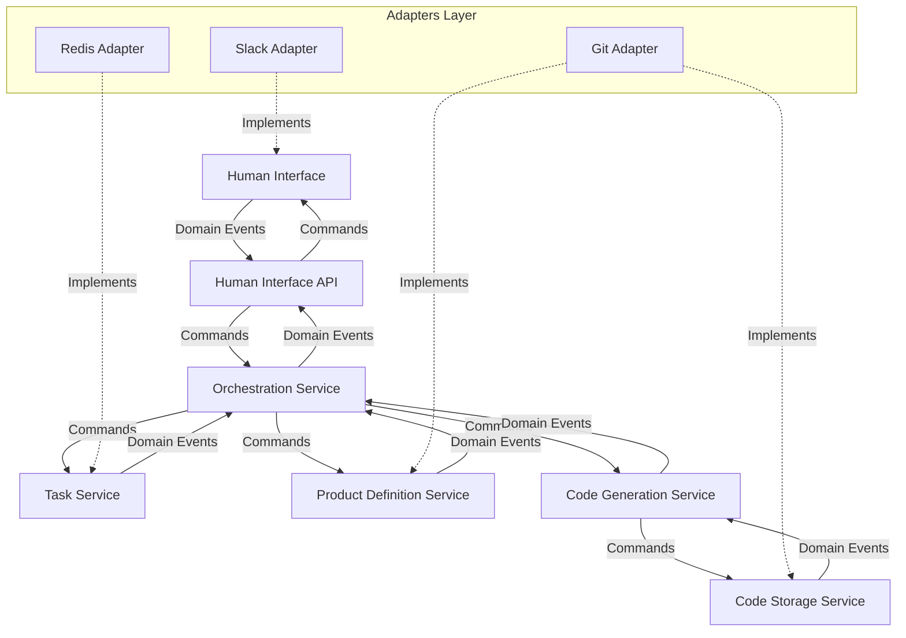
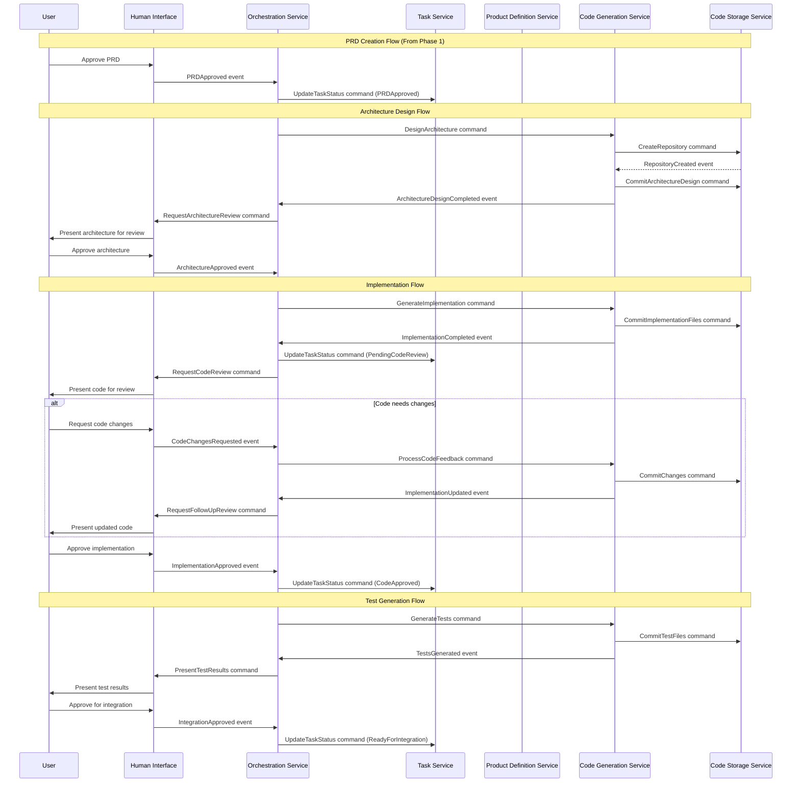

# Phase 2 Implementation: Code Generation Workflow

## Overview

Phase 2 builds upon the foundation established in Phase 1 by implementing the code generation workflow. This phase focuses on enhancing the Orchestration Context and adding the Code Generation Context to transform approved Product Requirements into implementation code.

## Goals

- Implement the code generation workflow
- Enhance PRD validation with human checkpoints
- Create a flexible, extensible Coding Agent
- Implement code storage and versioning

## Domain Model Extensions

### New Bounded Contexts

1. **Code Generation Context**
   - Responsible for transforming requirements into code
   - Manages code structure and organization
   - Handles code testing and validation

2. **Code Storage Context**
   - Manages code repositories and versioning
   - Handles branching and merging strategies
   - Maintains code history and traceability

### Enhanced Existing Contexts

1. **Orchestration Context** (Enhanced)
   - Extended to support code generation workflow
   - Manages human validation checkpoints
   - Coordinates between Product Definition and Code Generation

2. **Human Interaction Context** (Enhanced)
   - Extended with code review capabilities
   - Added implementation approval workflows
   - Enhanced notification system for code events

### Additional Domain Events

1. **PRD Approved**: Triggered when a PRD is approved for implementation
2. **Architecture Design Started**: Triggered when architecture design begins
3. **Architecture Design Completed**: Triggered when architecture design is ready for review
4. **Architecture Approved**: Triggered when architecture is approved
5. **Implementation Started**: Triggered when code implementation begins
6. **Implementation Completed**: Triggered when implementation is ready for review
7. **Code Changes Requested**: Triggered when code review suggests changes
8. **Implementation Approved**: Triggered when code is approved
9. **Tests Generated**: Triggered when tests are created for the implementation
10. **Integration Ready**: Triggered when code is ready for integration

## Extended Architecture

### System Architecture

### Strategic Domain Design

#### New Aggregates

1. **Code Repository Aggregate**
   - Root: CodeRepository
   - Entities: CodeFile, CommitHistory
   - Value Objects: FilePath, CommitMessage
   - Invariants: Repository must have a valid structure

2. **Architecture Design Aggregate**
   - Root: ArchitectureDesign
   - Entities: Component, Interface
   - Value Objects: ComponentRelationship, DesignPrinciple
   - Invariants: Components must have defined interfaces

3. **Implementation Plan Aggregate**
   - Root: ImplementationPlan
   - Entities: CodeTask, TestTask
   - Value Objects: TaskPriority, TaskDependency
   - Invariants: Tasks must have dependencies resolved

#### Enhanced Domain Services

1. **ValidationCheckpointService**: Manages human validation points in the workflow
2. **CodeGenerationService**: Transforms requirements into implementable code
3. **ArchitectureDesignService**: Creates software architecture from requirements
4. **CodeReviewService**: Manages code review process and feedback
5. **TestGenerationService**: Creates tests for implemented code
6. **CodeStorageService**: Manages code versioning and organization

### Tactical Design

#### Code Generation API (Port)

- **Responsibility**: Transform requirements into code
- **Key Methods**:
  - Generate architecture design
  - Generate implementation code
  - Generate test code
  - Process feedback
  - Estimate implementation scope

#### Code Storage API (Port)

- **Responsibility**: Manage code repositories
- **Key Methods**:
  - Create repository
  - Commit changes
  - Create branch
  - Merge changes
  - Retrieve file or directory

#### Enhanced Human Interface API (Port)

- **Responsibility**: Handle enriched user interactions
- **Key Methods**:
  - Request code review
  - Display code diffs
  - Present architecture diagrams
  - Request implementation approval
  - Register approval handlers

#### Enhanced Orchestration API (Port)

- **Responsibility**: Coordinate expanded workflow
- **Key Methods**:
  - Manage validation checkpoints
  - Route code generation tasks
  - Handle review feedback
  - Coordinate between contexts
  - Manage workflow transitions

## Enhanced Workflow

## Value Objects and Entities

### Code Generation Context

- **CodeFile**: Entity representing a source code file
- **TestFile**: Entity representing a test file
- **SourceCode**: Value object containing actual code
- **CodeLanguage**: Value object representing programming language
- **CodeMetrics**: Value object containing code quality metrics
- **TestResult**: Value object representing test execution outcome
- **ImplementationStrategy**: Value object defining implementation approach

### Architecture Design

- **Component**: Entity representing a software component
- **Interface**: Entity representing a component interface
- **Dependency**: Value object representing dependencies between components
- **ArchitecturePattern**: Value object defining architectural pattern
- **ComponentResponsibility**: Value object defining component responsibilities

### Code Storage

- **Repository**: Entity representing a code repository
- **Branch**: Entity representing a code branch
- **Commit**: Entity representing a code commit
- **FilePath**: Value object representing file location
- **CommitMessage**: Value object containing commit description
- **VersionTag**: Value object representing a specific version

## Implementation Plan

### Week 1-2: Domain Model Extension

- Extend domain model with new contexts
- Define code generation aggregates and entities
- Implement repository interfaces for code storage
- Create validation checkpoint service
- Extend event system for code generation events

### Week 3-4: Code Generation Service

- Implement code generation context
- Create architecture design capabilities
- Implement code generation service
- Develop test generation service
- Create code review service

### Week 5-6: Workflow Enhancement

- Extend orchestration service for code workflow
- Implement validation checkpoints
- Create adapters for code storage
- Implement feedback handling mechanisms
- Set up code metrics and quality gates

### Week 7-8: Integration and Refinement

- Integrate all contexts through event system
- Optimize code generation capabilities
- Enhance human interfaces for code review
- Create comprehensive documentation
- Prepare for user acceptance testing

## Success Criteria

- Users can review and approve PRDs
- The system generates architecture designs for review
- Implementation code is generated based on approved designs
- Code is stored with proper versioning and organization
- Users can review code and provide feedback
- The system responds to feedback with updated implementations
- Tests are generated for all implementations
- The workflow from requirements to code is fully tracked

## Next Steps

After successful implementation of Phase 2, we will proceed to:

1. Advanced AI capabilities in Phase 3
2. Deployment pipeline integration
3. Analytics and monitoring implementation
4. System scaling for larger workloads 