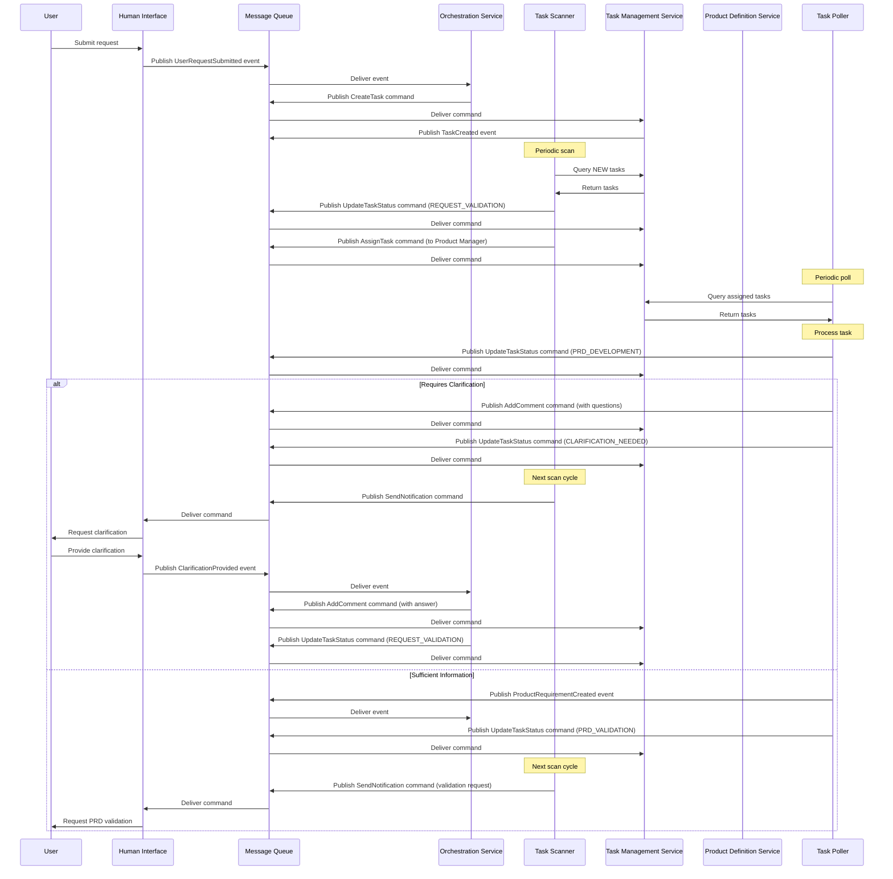
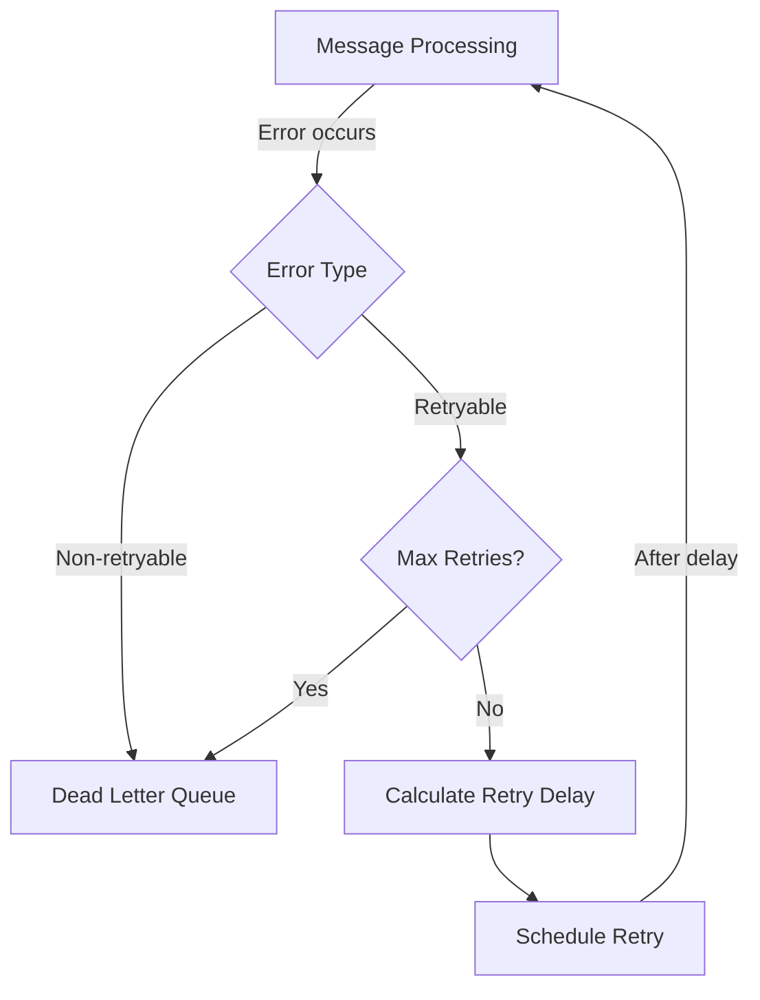
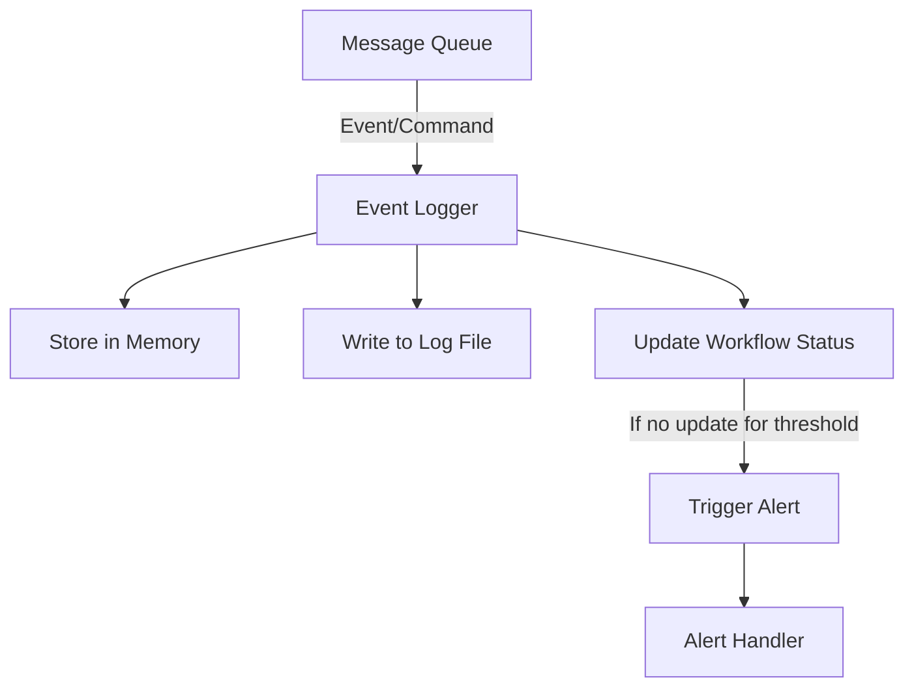

# Workflow Integration

This document provides an overview of the workflow integration implementation for the AI-driven development pipeline, focusing on the asynchronous communication between bounded contexts.

## Overview

The workflow integration implements the asynchronous communication between different bounded contexts (Human Interaction, Task Management, Product Definition, and Orchestration) to enable the product refinement workflow. It follows an event-driven architecture where components communicate through a message queue, exchanging events and commands.

For more details on the architectural decision, see [ADR-006: Asynchronous Workflow Integration](arch/adr/006-asynchronous-workflow-integration.md).

## Components

### Message Queue

The message queue serves as the central communication mechanism between bounded contexts. It supports publishing and subscribing to events and commands, with two implementations:

1. **InMemoryMessageQueue**: Used for testing and development
2. **RabbitMQMessageQueue**: Used for production deployment

The message queue interface is defined in `src/infrastructure/message_queue/message_queue.py`.

### Domain Events and Commands

Domain events and commands are strongly typed messages that flow through the system. They include metadata such as:

- Event/Command ID
- Type
- Timestamp
- Source
- Correlation ID (for tracking related messages)
- Causation ID (for tracking cause-effect relationships)

Events and commands are defined in `src/infrastructure/message_queue/domain_events.py`.

### Task Scanning Service

The Task Scanning Service runs in the Orchestration Context and periodically scans for tasks that need attention. It performs the following operations:

1. Scans for NEW tasks and transitions them to REQUEST_VALIDATION, assigning them to the Product Manager agent pool
2. Scans for CLARIFICATION_NEEDED tasks and sends notifications to users
3. Scans for PRD_VALIDATION tasks and sends notifications to users for validation

The Task Scanning Service is implemented in `src/orchestration/application/task_scanning_service.py`.

### Task Polling Service

The Task Polling Service runs in the Product Definition Context and polls for tasks assigned to the Product Manager agent pool. It:

1. Polls for tasks assigned to the Product Manager agent pool
2. Selects the highest priority task for processing
3. Delegates task processing to the Product Manager Agent
4. Handles the result, either requesting clarification or storing the PRD and updating task status

The Task Polling Service is implemented in `src/product_definition/application/task_polling_service.py`.

### Error Handling

Error handling is implemented in `src/infrastructure/message_queue/error_handler.py` and provides:

1. Retry mechanism with exponential backoff
2. Dead letter queue for unprocessable messages
3. Error classification into retryable and non-retryable errors
4. Logging of all errors with context information

### Event Monitoring

Event monitoring is implemented in `src/infrastructure/message_queue/event_monitor.py` and provides:

1. Tracking of all events and commands flowing through the system
2. Detection of stalled workflows based on configurable thresholds
3. Alerts for anomalies such as stalled workflows or error patterns
4. Comprehensive logging for debugging and analysis

## Workflow Integration Service

The Workflow Integration Service ties all components together and is implemented in `src/workflow_integration.py`. It:

1. Initializes all components with appropriate configuration
2. Starts and stops services in the correct order
3. Connects the message queue to the monitoring system
4. Handles workflow alerts and implements recovery actions

## Configuration

The workflow integration can be configured through command-line arguments or environment variables:

### Command-line Arguments

```
usage: workflow_integration.py [-h] [--message-queue-type {in_memory,rabbitmq}] [--scan-interval SCAN_INTERVAL]
                               [--poll-interval POLL_INTERVAL] [--log-directory LOG_DIRECTORY]

Start the workflow integration service

optional arguments:
  -h, --help            show this help message and exit
  --message-queue-type {in_memory,rabbitmq}
                        Type of message queue to use (default: in_memory)
  --scan-interval SCAN_INTERVAL
                        Interval in seconds between task scans (default: 300)
  --poll-interval POLL_INTERVAL
                        Interval in seconds between task polls (default: 60)
  --log-directory LOG_DIRECTORY
                        Directory for storing event logs (default: logs)
```

### Environment Variables

When using RabbitMQ, the following environment variables can be set:

- `RABBITMQ_HOST`: RabbitMQ host (default: localhost)
- `RABBITMQ_PORT`: RabbitMQ port (default: 5672)
- `RABBITMQ_USERNAME`: RabbitMQ username (default: guest)
- `RABBITMQ_PASSWORD`: RabbitMQ password (default: guest)

## Usage

To start the workflow integration service:

```bash
# Using in-memory message queue (for development)
python src/workflow_integration.py

# Using RabbitMQ (for production)
RABBITMQ_HOST=rabbitmq-server RABBITMQ_USERNAME=admin RABBITMQ_PASSWORD=password \
python src/workflow_integration.py --message-queue-type rabbitmq
```

## Testing

Unit tests for the workflow integration are in `tests/test_workflow_integration.py` and can be run with:

```bash
python -m unittest tests/test_workflow_integration.py
```

The tests verify:

1. Service initialization and component creation
2. Starting and stopping the service
3. Event flow through the integrated system
4. Stalled workflow detection and alerting
5. Correct component configuration

## Sequence Diagram

The following sequence diagram illustrates the flow of messages through the system for a typical product refinement workflow:



## Error Handling Flow

The following diagram illustrates the error handling flow:



## Event Monitoring Flow

The following diagram illustrates the event monitoring flow:



## Limitations and Future Improvements

1. **Message Persistence**: Currently, the in-memory implementation does not persist messages, which could lead to message loss in case of system crashes. Future improvements could include adding persistence to the in-memory queue for development use.

2. **Scalability**: The current implementation supports running a single instance of each service. Future improvements could include support for multiple instances of each service with load balancing.

3. **Monitoring Dashboard**: A web-based dashboard for monitoring workflow status and system health would improve observability.

4. **Dynamic Configuration**: Support for dynamic configuration changes without service restart would improve operational flexibility.

5. **Integration Tests**: More comprehensive integration tests covering full end-to-end workflows would improve reliability.

## Conclusion

The workflow integration implementation provides a robust foundation for asynchronous communication between bounded contexts in the AI-driven development pipeline. It supports reliable message delivery, comprehensive monitoring, and error handling, enabling a scalable and maintainable system. 